{/* TODO:
Verify:
- Mermaid diagrams use theme colours (hardcoded - see mermaid-colours.jsx)
- Fontawesome icons on accordions
- Tables use StyledTable with thead/tbody
- No em-dashes
- UK spelling throughout
- Headers concise and technical
- REVIEW flags below for SME verification
Human:
- REVIEW flags - particularly on commercial operator names and revenue figures
- Review page layout for Persona D/C journey fit
*/}

import { LinkArrow } from '/snippets/components/primitives/links.jsx'
import { StyledTable, TableRow, TableCell } from '/snippets/components/layout/tables.jsx'
import { CustomDivider } from '/snippets/components/primitives/divider.jsx'
import { ScrollableDiagram } from '/snippets/components/content/zoomableDiagram.jsx'
import { CenteredContainer, BorderedBox } from '/snippets/components/layout/containers.jsx'

<CustomDivider style={{margin: "-1rem 0 -1rem 0"}} />

Commercial Orchestrator operation is not just the same node with better uptime. It is a different
economic model: Gateways send work because the node is fast, predictable, and worth paying for at
production standards.

This page is for operators deciding whether to make that step. It explains how fee-driven operation
differs from inflation-first participation, what Gateways actually care about, and what has to
change when the goal is recurring service revenue rather than opportunistic earnings.

For the mechanics of how both revenue streams work, see <LinkArrow href="/v2/orchestrators/concepts/incentive-model" label="Incentive Model" newline={false} />. For pricing configuration, see <LinkArrow href="/v2/orchestrators/guides/config-and-optimisation/pricing-strategy" label="Pricing Strategy" newline={false} />.

<CustomDivider middleText="Two Operating Models" style={{margin: "-1rem 0 -2rem 0"}} />

## Hobbyist vs Commercial

The Livepeer Orchestrator ecosystem supports both models, but they reward different behaviour. One
is optimised for lower-risk participation and base rewards. The other is optimised for being chosen,
trusted, and paid for by Gateways running real products.

```mermaid
%%{init: {'theme': 'base', 'themeVariables': { 'primaryColor': '#1a1a1a', 'primaryTextColor': '#fff', 'primaryBorderColor': '#2d9a67', 'lineColor': '#2d9a67', 'secondaryColor': '#0d0d0d', 'tertiaryColor': '#1a1a1a', 'background': '#0d0d0d', 'fontFamily': 'system-ui' }}}%%
flowchart LR
    subgraph HOB["Hobbyist Model"]
        direction TB
        H1["Primary income:\nLPT inflation rewards"]
        H2["Revenue driver:\nStake size"]
        H3["Gateway relationship:\nPassive (get selected)"]
        H4["Uptime target:\n~95%"]
        H5["Hardware:\nExisting GPU, amortised"]
    end

    subgraph COM["Commercial Model"]
        direction TB
        C1["Primary income:\nETH service fees"]
        C2["Revenue driver:\nJob volume + pricing"]
        C3["Gateway relationship:\nActive (build relationships)"]
        C4["Uptime target:\n99%+"]
        C5["Hardware:\nDedicated, planned investment"]
    end

    classDef default fill:#1a1a1a,color:#fff,stroke:#2d9a67,stroke-width:2px
    style HOB fill:#0d0d0d,stroke:#2d9a67,stroke-width:1px
    style COM fill:#0d0d0d,stroke:#18794E,stroke-width:2px
```



<StyledTable variant="bordered">
  <thead>
    <TableRow header>
      <TableCell header>Dimension</TableCell>
      <TableCell header>Hobbyist operator</TableCell>
      <TableCell header>Commercial operator</TableCell>
    </TableRow>
  </thead>
  <tbody>
    <TableRow>
      <TableCell>**Primary income**</TableCell>
      <TableCell>LPT inflation rewards</TableCell>
      <TableCell>ETH service fees from job processing</TableCell>
    </TableRow>
    <TableRow>
      <TableCell>**Revenue lever**</TableCell>
      <TableCell>Total bonded stake</TableCell>
      <TableCell>Job volume, pricing discipline, uptime</TableCell>
    </TableRow>
    <TableRow>
      <TableCell>**Uptime requirement**</TableCell>
      <TableCell>~95% (reward calls + basic availability)</TableCell>
      <TableCell>99%+ (SLA-driven, continuous monitoring)</TableCell>
    </TableRow>
    <TableRow>
      <TableCell>**Gateway relationship**</TableCell>
      <TableCell>Passive - wait to be selected by price and stake</TableCell>
      <TableCell>Active - direct relationships, per-Gateway pricing</TableCell>
    </TableRow>
    <TableRow>
      <TableCell>**Hardware approach**</TableCell>
      <TableCell>Existing hardware repurposed</TableCell>
      <TableCell>Dedicated investment, redundancy planned</TableCell>
    </TableRow>
    <TableRow>
      <TableCell>**Monitoring**</TableCell>
      <TableCell>Periodic checks, Prometheus optional</TableCell>
      <TableCell>Automated alerting, SLA dashboards</TableCell>
    </TableRow>
    <TableRow>
      <TableCell>**Model loading**</TableCell>
      <TableCell>Load on demand; cold starts acceptable</TableCell>
      <TableCell>Pre-loaded and warm; cold starts are SLA failures</TableCell>
    </TableRow>
  </tbody>
</StyledTable>

Neither model is inherently better. They serve different operator goals. Many of the strongest nodes
eventually run a hybrid, using inflation as the base layer and service fees as the part that scales.

<CustomDivider middleText="Service Fee Economics" style={{margin: "-1rem 0 -2rem 0"}} />

## Why Service Fees Scale

For commercial operators, ETH service fees matter more because they scale with traffic rather than
with stake alone. That is the core shift in the business case: the upside comes from being part of
an application's serving path, not just from holding more bonded LPT.

An Orchestrator with significant staked LPT earns a fixed percentage of the round's inflation
regardless of how many jobs it processes. An Orchestrator serving high-volume AI inference workloads
earns ETH proportional to every pixel processed and every model inference returned.

```mermaid
%%{init: {'theme': 'base', 'themeVariables': { 'primaryColor': '#1a1a1a', 'primaryTextColor': '#fff', 'primaryBorderColor': '#2d9a67', 'lineColor': '#2d9a67', 'secondaryColor': '#0d0d0d', 'tertiaryColor': '#1a1a1a', 'background': '#0d0d0d', 'fontFamily': 'system-ui' }}}%%
flowchart LR
    subgraph FEES["Service Fee Income"]
        A["Jobs processed\n× price per unit"] --> B["ETH earnings\n(scales with volume)"]
    end
    subgraph REWARDS["Inflation Reward Income"]
        C["Total bonded stake\n× inflation rate"] --> D["LPT earnings\n(fixed % of round)"]
    end

    classDef default fill:#1a1a1a,color:#fff,stroke:#2d9a67,stroke-width:2px
    style FEES fill:#0d0d0d,stroke:#18794E,stroke-width:2px
    style REWARDS fill:#0d0d0d,stroke:#2d9a67,stroke-width:1px
```



For an Orchestrator actively serving a high-volume Gateway - a streaming platform, an AI product,
or a real-time video application - monthly ETH fee income from job processing can exceed LPT
inflation income by a substantial margin.

{/* REVIEW: Do not add specific revenue numbers here without verified data from active commercial operators. Keep this framing general until SME input is available. */}

<Note>
Commercial fee income is variable - it depends on Gateway demand, job mix, and market pricing
conditions. Inflation rewards are predictable by stake. Most commercial operators treat inflation as
a base and fees as the variable upside.
</Note>

<CustomDivider middleText="Operational Standards" style={{margin: "-1rem 0 -2rem 0"}} />

## What Commercial Operation Requires

This is where many otherwise capable operators self-select out. Commercial service is not about
running the same stack a little harder. It means meeting operational expectations that Gateways can
depend on in front of their own users.

### Uptime and reliability

A Gateway operator building a product on Livepeer's network needs the Orchestrators it routes to
to be consistently available. If an Orchestrator fails mid-session, the Gateway must failover -
introducing latency and degraded user experience. Repeated failures result in the Orchestrator
being deprioritised in the Gateway's selection algorithm.

Commercial Orchestrators target 99%+ uptime. This requires:

- Automated monitoring with immediate alerts on node failure
- Automated restart and recovery
- Stable, redundant connectivity (not shared home broadband)
- Consistent power supply (UPS or colocation)
- Hardware health monitoring (GPU temperatures, VRAM utilisation)

### Model warm-up management

For AI inference workloads, cold model starts (loading a model from disk into VRAM on first request)
introduce latency that breaks user-facing SLAs. Commercial AI Orchestrators pre-load all advertised
models at startup and keep them warm.

The practical implication: the VRAM requirements for commercial AI operation are determined by the
sum of all models that must be simultaneously loaded, not just the largest single model.

### Latency targets

Gateways rank Orchestrators by response latency among other factors. Consistently slow responses
- even within acceptable job completion time - affect long-term selection probability.

Commercial Orchestrators optimise for:
- Network proximity to high-volume Gateways
- Low GPU scheduling latency (dedicated GPU, not shared)
- Fast storage for model weights (NVMe preferred over SATA)

{/* TODO: Add screenshot of Livepeer Explorer showing orchestrator response time metrics when available */}

<CustomDivider middleText="Gateway Relationships" style={{margin: "-1rem 0 -2rem 0"}} />

## Working with Gateways

Anonymous discovery is enough to get started. It is rarely enough to build durable commercial
traffic. Commercial operators still need to be competitively discoverable, but they also work
deliberately to become a reliable option for specific Gateway needs.

### Per-Gateway pricing

The `-pricePerGateway` flag allows Orchestrators to set different prices for specific Gateway
addresses. This is the primary tool for commercial Gateway relationships:

```bash icon="terminal" title="per-gateway pricing"
# Set a negotiated rate for a specific high-volume Gateway
-pricePerGateway='{"0xGatewayEthAddress": 800, "0xOtherGateway": 950}'
```

A high-volume Gateway that commits consistent traffic in exchange for a preferred rate is a
commercially valuable relationship. Per-Gateway pricing formalises that arrangement at the
protocol level without requiring any off-chain contract.

### Capability signalling

Gateways discover AI capabilities through the capability manifest returned during session
negotiation. Commercial Orchestrators ensure their declared capabilities are accurate and
stable - advertising a model that is slow to load or frequently unavailable damages the
Gateway's product and the Orchestrator's selection score.

Practical discipline for commercial capability management:

- Declare only models that are loaded and warm at startup
- Remove capability declarations for models that are not being actively served
- Use `-aiModels` to specify exactly which pipeline/model combinations to load on startup
- Monitor model load times and remove slow-start models from the active set

### Building Gateway relationships

{/* REVIEW: The following is general guidance; specific Gateway operator names or contacts should be verified and updated by the operator community before publishing. */}

Active commercial relationships with Gateways typically develop through:

- Consistent performance history visible on the Livepeer Explorer
- Participation in the `#orchestrators` channel on the [Livepeer Discord](https://discord.gg/livepeer)
- Direct outreach to Gateway SPEs and ecosystem partners
- Demonstrated capability support for pipelines that specific Gateways need

Gateways serving AI products actively look for Orchestrators with specific capability profiles.
An Orchestrator running a pipeline that a Gateway cannot currently source from the network has
real negotiating leverage.

<CustomDivider middleText="Positioning for Work" style={{margin: "-1rem 0 -2rem 0"}} />

## How to Position for Commercial Workloads

The shift from passive inflation earner to active commercial operator usually means narrowing focus,
not broadening it. The goal is to become reliably good at the workloads and service levels that a
Gateway actually wants to buy.

<AccordionGroup>
  <Accordion title="Capability selection" icon="microchip">

    Commercial operators do not win by listing everything. They win by being reliably good at work
    that Gateways are already trying to source. Check current network demand at
    [tools.livepeer.cloud/ai/network-capabilities](https://tools.livepeer.cloud/ai/network-capabilities)
    to see which pipelines are being routed and at what prices.

    Prioritise:
    - Pipelines with few available Orchestrators and active demand
    - High-VRAM models that exclude commodity GPU competition
    - Cascade (real-time AI) pipelines if hardware supports it - higher per-job value

  </Accordion>
  <Accordion title="Pricing discipline" icon="tag">

    Commercial pricing is part market positioning and part relationship management. It requires:

    - Understanding the Gateway's `maxPricePerUnit` ceiling for each pipeline
    - Setting prices that are competitive but not floor-level (under-pricing signals low quality to some Gateway operators)
    - Using `-pricePerGateway` to offer volume discounts to specific Gateways
    - Using `-autoAdjustPrice` carefully - automatic adjustment can undercut commercial relationships

    See <LinkArrow href="/v2/orchestrators/guides/config-and-optimisation/pricing-strategy" label="Pricing Strategy" newline={false} /> for configuration guidance.

  </Accordion>
  <Accordion title="Infrastructure investment" icon="server">

    Commercial operations typically require infrastructure changes that hobbyist setups do not:

    - **Colocation or cloud GPU** instead of home hardware, for reliability and connectivity
    - **Dedicated GPUs** with no competing workloads (mining rigs sharing GPUs with Livepeer
      introduce unpredictable latency)
    - **Redundant connectivity** with failover (not a single home ISP connection)
    - **UPS or colocation power** for uptime targets above 99%

    Hardware investment for commercial operation should be planned against projected service fee
    income, not against inflation rewards alone. The break-even analysis is different.

  </Accordion>
  <Accordion title="Monitoring and alerting" icon="chart-line">

    Commercial uptime targets require monitoring that catches problems before a Gateway notices them. go-livepeer exposes a Prometheus
    metrics endpoint (port 7935 by default). Connect this to an alerting stack (Grafana,
    PagerDuty, or equivalent) to detect:

    - Node offline or unreachable
    - GPU memory pressure (model eviction)
    - Reward call failures
    - Unusual session failure rates

    Manual monitoring (periodic log checks) is insufficient for commercial SLA targets.
    See <LinkArrow href="/v2/orchestrators/guides/monitoring-and-tooling/metrics-and-alerting" label="Metrics and Monitoring" newline={false} /> for setup guidance.

  </Accordion>
</AccordionGroup>

<CustomDivider middleText="Who Operates Commercially" style={{margin: "-1rem 0 -2rem 0"}} />

## The Commercial Operator Landscape

Commercial operation does not look the same across the network. The common thread is fee revenue,
but the operating model changes depending on who owns the GPUs, who manages stake, and how traffic
is sourced.

**Pool operators** manage the Orchestrator registration, on-chain staking, and reward calling for a
fleet of GPU workers. Workers register under the pool's Orchestrator address; the pool earns
a margin on their job income. Pool operators are effectively GPU infrastructure businesses,
combining the service fee model with a managed-Orchestrator offering.

{/* REVIEW: Add named pool operators here once confirmed with community - Titan-Node is known but confirm active commercial status and whether they want to be named in docs. */}

**Enterprise GPU operators** run dedicated fleets serving specific AI application workloads. These
operators serve Gateways that power user-facing AI products and require SLA-level commitments.
Their hardware is typically data-centre grade with redundant connectivity.

**Dual-workload operators** run both video transcoding and AI inference from the same infrastructure,
earning fees from both streams. This is the natural next step for video Orchestrators who invest in
high-VRAM GPUs.

<Note>
The commercial orchestrator landscape is evolving. The [Livepeer Forum](https://forum.livepeer.org)
and the `#orchestrators` Discord channel contain the most current information on who is operating
commercially and what workloads are available.
</Note>

<CustomDivider style={{margin: "-1rem 0 -2rem 0"}} />

## Related Pages

<CardGroup cols={2}>
  <Card title="Operating Rationale" icon="scale-balanced" href="/v2/orchestrators/guides/operator-considerations/operator-rationale" arrow horizontal>
    Financial evaluation - costs, revenue streams, and the decision matrix for choosing your path.
  </Card>
  <Card title="Pricing Strategy" icon="tag" href="/v2/orchestrators/guides/config-and-optimisation/pricing-strategy" arrow horizontal>
    How to configure competitive prices for video and AI workloads, including per-Gateway rates.
  </Card>
  <Card title="Working with Gateways" icon="handshake" href="/v2/orchestrators/guides/advanced-operations/gateway-relationships" arrow horizontal>
    The technical and operational details of the Gateway-Orchestrator relationship.
  </Card>
  <Card title="Operator Impact" icon="landmark" href="/v2/orchestrators/guides/operator-considerations/operator-impact" arrow horizontal>
    Why operating an Orchestrator matters beyond earnings - governance weight, network stewardship, and protocol influence.
  </Card>
</CardGroup>

{/*
  PURPOSE:
  "What if I'm a business, not a hobbyist?" The commercial orchestrator model.
  Serving application workloads (Livepeer Studio, Daydream, custom platforms) under
  SLAs. Service fee economics vs inflation. Per-gateway pricing. The mental model
  shift from "mining" to "infrastructure provider." Who the current commercial
  orchestrators are.

  PLAN TARGET: business-case (keep)
  SECTION: Operator Considerations → "Should I operate?"
  JOB STORIES: J4 (commercial infrastructure)

  CROSS-REFS:
  - Config & Optimisation > Pricing Strategy - per-gateway pricing
  - Advanced Operations > Gateway Relationships - gateway commercial relationships
  - Staking & Earning > earning-model - service fee vs inflation breakdown
*/}
