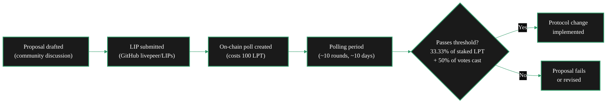
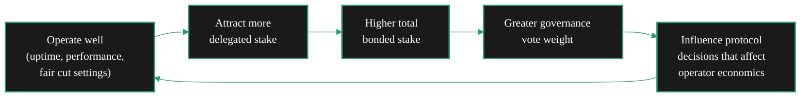

{/* TODO:
Verify:
- Mermaid diagrams use theme colours (hardcoded)
- Tables use StyledTable with thead/tbody
- No em-dashes
- UK spelling throughout
- Headers concise and technical
- REVIEW flags below for SME verification
Human:
- REVIEW flags - particularly on historical governance examples
- Check governance mechanics against current LivepeerGovernor contract state
- Verify poll creation cost (100 LPT) is still current
*/}

import { LinkArrow } from '/snippets/components/primitives/links.jsx'
import { StyledTable, TableRow, TableCell } from '/snippets/components/layout/tables.jsx'
import { CustomDivider } from '/snippets/components/primitives/divider.jsx'
import { ScrollableDiagram } from '/snippets/components/content/zoomableDiagram.jsx'
import { CenteredContainer, BorderedBox } from '/snippets/components/layout/containers.jsx'

<CustomDivider style={{margin: "-1rem 0 -1rem 0"}} />

Orchestrators hold **governance weight** proportional to their total bonded stake. Every LPT staked
to an Orchestrator - whether self-staked or delegated - translates directly into voting influence
over the protocol that underpins their business. This page covers what that influence looks like in
practice, why it matters, and the broader case for Orchestrators as infrastructure stewards rather
than pure earnings participants.

For the mechanics of staking and delegation, see <LinkArrow href="/v2/orchestrators/guides/staking-and-rewards/network-participation" label="Governance Guide" newline={false} />. For delegator voting rights, see <LinkArrow href="/v2/orchestrators/guides/staking-and-rewards/delegate-operations" label="Attracting Delegators" newline={false} />.

<CustomDivider middleText="Governance Mechanics" style={{margin: "-1rem 0 -2rem 0"}} />

## How Votes Work

Livepeer governance uses a **stake-weighted voting system** built around Livepeer Improvement
Proposals (LIPs). Every active participant in the network - Orchestrators, Delegators, and LPT
holders - can influence protocol decisions through this mechanism.

Key mechanics:

- **Voting weight** equals total bonded stake (Orchestrator self-stake plus all delegated LPT)
- **Passing threshold** requires 33.33% of all staked LPT to support AND 50% of votes cast to approve
- **Delegator override** - Delegators can vote independently, overriding their Orchestrator's position on a specific LIP
- **Poll creation cost** - 100 LPT to create an on-chain poll, preventing low-effort or spam proposals

{/* REVIEW: Confirm 100 LPT poll creation cost is still current on the live contract. This was established in LIP-19 but may have been adjusted via governance since. */}

This design gives Orchestrators with large bonded stake substantial influence, while preserving
Delegator autonomy. An Orchestrator cannot vote on behalf of Delegators who choose to exercise
their own governance rights.

<CustomDivider middleText="What Gets Voted On" style={{margin: "-1rem 0 -2rem 0"}} />

## Scope of Governance

LIPs cover the full range of protocol decisions. Orchestrators who understand governance have an
ongoing stake - literally - in what direction these decisions take.

<StyledTable variant="bordered">
  <thead>
    <TableRow header>
      <TableCell header>Category</TableCell>
      <TableCell header>Examples</TableCell>
      <TableCell header>Orchestrator relevance</TableCell>
    </TableRow>
  </thead>
  <tbody>
    <TableRow>
      <TableCell>**Protocol parameters**</TableCell>
      <TableCell>Inflation rate targets, active set size, unbonding periods, slashing conditions</TableCell>
      <TableCell>Directly affects earnings (inflation) and competitive dynamics (active set size)</TableCell>
    </TableRow>
    <TableRow>
      <TableCell>**Fee structures**</TableCell>
      <TableCell>Ticket pricing models, payment ticket mechanics, fee distribution</TableCell>
      <TableCell>Affects how ETH service fees flow from Gateways to Orchestrators</TableCell>
    </TableRow>
    <TableRow>
      <TableCell>**Technical upgrades**</TableCell>
      <TableCell>New workload types, contract upgrades, AI subnet integration, capability expansions</TableCell>
      <TableCell>Determines which workloads the network supports and how they are priced</TableCell>
    </TableRow>
    <TableRow>
      <TableCell>**Treasury allocation**</TableCell>
      <TableCell>SPE grants, development funding, ecosystem programmes, infrastructure support</TableCell>
      <TableCell>Funds that support Orchestrator tooling, community pools, and ecosystem growth</TableCell>
    </TableRow>
    <TableRow>
      <TableCell>**Governance process**</TableCell>
      <TableCell>Quorum thresholds, voting periods, Foundation structure, DAO operations</TableCell>
      <TableCell>Shapes how future decisions are made</TableCell>
    </TableRow>
  </tbody>
</StyledTable>

The Livepeer Foundation, launched in 2025, coordinates ecosystem development and stewards the
long-term protocol vision - but governance authority over protocol parameters remains with
LPT holders. Orchestrators with large stake are consequential participants in every significant
protocol decision.

<Note>
Governance proposals and active LIPs are tracked on the [Livepeer Forum](https://forum.livepeer.org/c/governance/17)
and the [livepeer/LIPs GitHub repository](https://github.com/livepeer/LIPs). Following these is
a practical prerequisite for informed governance participation.
</Note>

<CustomDivider middleText="Influence and Stake" style={{margin: "-1rem 0 -2rem 0"}} />

## Stake as Governance Capital

Governance weight in Livepeer is not merely about voting on individual proposals. Stake represents
a long-term commitment to the network's direction, and large Orchestrators carry influence
proportional to that commitment.

This creates an alignment between operating well and having meaningful protocol influence. Orchestrators
who consistently deliver reliable service, maintain competitive pricing, and build trust with Delegators
accumulate more bonded stake over time - and with it, more governance weight.

The concentration of stake matters. Active Orchestrators represent the majority of staked LPT in
the network. On any contested governance vote, the position taken by large Orchestrators is often
decisive.

<Warning>
Governance weight comes with governance responsibility. Orchestrators that hold large stake and vote
on proposals affect outcomes for all network participants - Delegators who trusted them with LPT,
Gateways that depend on the network for their products, and the broader Livepeer ecosystem. Most
Delegators do not vote independently; their stake defaults to their Orchestrator's position.
</Warning>

<CustomDivider middleText="The Sovereign Compute Case" style={{margin: "-1rem 0 -2rem 0"}} />

## Beyond Earnings: Sovereign Compute

The economic case for running a Livepeer Orchestrator is covered in <LinkArrow href="/v2/orchestrators/guides/operator-considerations/operator-rationale" label="Operating Rationale" newline={false} />. The governance case is about something larger: who controls the infrastructure that processes the world's video and AI.

The dominant alternative is centralised cloud compute. AWS, Azure, and GCP provide the GPU
infrastructure that powers the majority of video transcoding and AI inference globally. This
concentration creates:

- **Single points of control** - a policy change at a major provider affects all its customers
  simultaneously
- **Censorship vectors** - centralised providers can and do restrict access to certain content or
  customers under legal or commercial pressure
- **Vendor lock-in** - platforms built on proprietary cloud infrastructure cannot easily migrate
  away
- **Pricing power** - without competitive alternatives, cloud providers set the terms

Livepeer Orchestrators collectively operate the alternative. A decentralised network of GPU operators,
governed by the token holders themselves, with no single entity that can suspend, censor, or price-out
a participant.

<AccordionGroup>
  <Accordion title="For independent media" icon="video">

    Video infrastructure controlled by centralised platforms is subject to those platforms' content
    policies. Independent creators in jurisdictions with restrictive internet governance, or producing
    content that falls into contested categories, have limited recourse when a cloud provider
    terminates service.

    A permissionless compute network with no single controller provides a meaningfully different
    infrastructure substrate. Orchestrators are the physical embodiment of that alternative.

  </Accordion>
  <Accordion title="For AI researchers" icon="microchip">

    AI research increasingly requires GPU access at scale. Centralised providers gatekeep this through
    pricing, account verification, acceptable use policies, and geographic restrictions. Researchers
    in emerging markets or working on models that touch policy-sensitive domains face additional
    barriers.

    Livepeer's permissionless AI inference network lowers these barriers. Any application can access
    GPU compute by paying the market rate in ETH - no account approval, no content policy review,
    no geographic restriction.

  </Accordion>
  <Accordion title="For platforms avoiding lock-in" icon="building">

    Platforms built on proprietary cloud infrastructure are subject to that provider's pricing and
    availability. A provider raising GPU pricing by 30%, or deprecating a service, creates immediate
    operational risk.

    Building on an open, permissionless network with multiple competing Orchestrators distributes
    that risk. No single Orchestrator's failure or pricing change can disrupt a well-configured Gateway.

  </Accordion>
  <Accordion title="For developers building on open compute" icon="code">

    Open compute infrastructure enables applications that would not exist on centralised platforms:
    uncensorable media archives, AI applications with no usage monitoring, platforms operating across
    jurisdictions where centralised services are blocked.

    The developer community building on Livepeer depends on Orchestrators to make this infrastructure
    real. An Orchestrator is not just an earner - it is a node in the substrate that makes these
    applications possible.

  </Accordion>
</AccordionGroup>

<CustomDivider middleText="Participation in Practice" style={{margin: "-1rem 0 -2rem 0"}} />

## Practical Governance Participation

Governance participation for Orchestrators means more than occasionally voting on LIPs. The most
consequential participation happens before a vote.

**Follow active proposals.** The [Livepeer Forum governance category](https://forum.livepeer.org/c/governance/17)
is where proposals develop before reaching an on-chain vote. Early discussion shapes what ends up
being voted on. Orchestrators with specific operational perspectives - pricing mechanics, hardware
requirements for new workload types, impact on earnings - provide signal that proposal authors and
the broader community need.

**Vote on LIPs.** Voting can be done via the [Livepeer Explorer](https://explorer.livepeer.org/voting).
Orchestrators that hold significant stake but consistently abstain reduce the effective quorum
available for passing beneficial proposals and signal low engagement to their Delegators.

**Communicate governance positions to Delegators.** Since Delegators default to their Orchestrator's
vote unless they vote independently, Orchestrators with large delegated stake have an obligation to
communicate how they intend to vote on significant proposals. Transparent governance communication is
a quality signal that influences delegation decisions.

**Engage with SPE proposals.** The Strategic Priority Enabler (SPE) framework allocates treasury
resources to specific ecosystem initiatives. SPE proposals affect what infrastructure, tooling, and
growth programmes get funded. Orchestrators who benefit from or are affected by specific SPE programmes
have direct interest in these votes.

{/* REVIEW: Add links to active SPE governance discussions when available - check forum.livepeer.org for current SPE-related threads */}

<CustomDivider style={{margin: "-1rem 0 -2rem 0"}} />

## Related Pages

<CardGroup cols={2}>
  <Card title="Operating Rationale" icon="scale-balanced" href="/v2/orchestrators/guides/operator-considerations/operator-rationale" arrow horizontal>
    The financial case for running a node - costs, revenue, and decision matrix.
  </Card>
  <Card title="Governance Guide" icon="vote-yea" href="/v2/orchestrators/guides/staking-and-rewards/network-participation" arrow horizontal>
    How to participate in governance - voting steps, proposal process, and Explorer guide.
  </Card>
  <Card title="Attracting Delegators" icon="users" href="/v2/orchestrators/guides/staking-and-rewards/delegate-operations" arrow horizontal>
    How to grow delegated stake and build the governance weight that comes with it.
  </Card>
  <Card title="LPT Token Overview" icon="coins" href="/v2/lpt/about/overview" arrow horizontal>
    The role of LPT in governance, staking, and the broader Livepeer protocol.
  </Card>
</CardGroup>

{/*
  PURPOSE:
  "Why does this matter beyond money?" The sovereignty and governance case.
  Orchestrators carry governance weight proportional to total stake. What gets
  voted on (LIPs, treasury, protocol parameters). The sovereign compute thesis:
  open infrastructure vs cloud monopoly. Censorship resistance. Permissionless
  GPU access. The compounding effect: better operation leads to more delegation
  leads to more governance weight leads to more protocol influence.

  PLAN TARGET: protocol-influence (keep)
  SECTION: Operator Considerations → "Should I operate?"
  JOB STORIES: J5 (governance influence)

  CROSS-REFS:
  - Staking & Earning > Governance Participation - voting mechanics (how)
  - Staking & Earning > Growing Delegation - growing governance weight
  - LPT Tab > Governance - shared governance model
*/}
