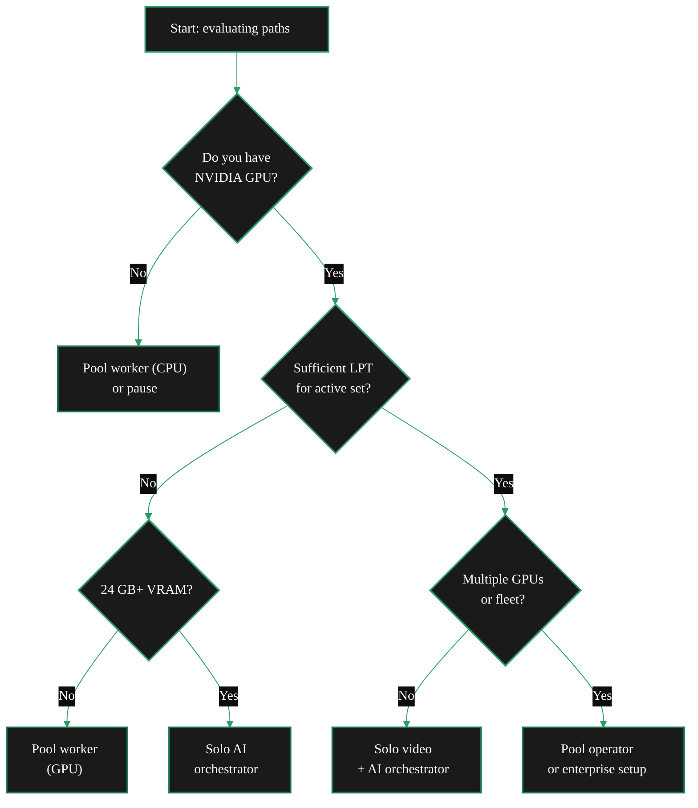

{/* TODO:
Verify:
- Mermaid diagrams use theme colours (hardcoded - see mermaidColours.jsx)
- Fontawesome icons on accordions and tabs
- Tables use StyledTable component with thead/tbody
- No em-dashes
- UK spelling throughout
- Headers concise and technical
- CustomDivider margins correct per skill patterns
- Media placeholder: TODO tags used for any screenshots/video
Human:
- Confirm the active-set size where this page references Explorer
- Confirm the ABR ladder bandwidth figures
- Recheck factual TODO comments before publishing
*/}

import { LinkArrow } from '/snippets/components/primitives/links.jsx'
import { StyledTable, TableRow, TableCell } from '/snippets/components/layout/tables.jsx'
import { CustomDivider } from '/snippets/components/primitives/divider.jsx'
import { ScrollableDiagram } from '/snippets/components/content/zoomableDiagram.jsx'
import { CenteredContainer, BorderedBox } from '/snippets/components/layout/containers.jsx'

<CustomDivider />

Run a Livepeer Orchestrator when the earning path matches your hardware, stake access, and operating tolerance. The right answer is sometimes a pool worker, sometimes an AI-first node, and sometimes a full solo Orchestrator.

Use this page to choose that path. It breaks the decision into costs, revenue streams, viability checks, and workload trade-offs so you can stop early, start with a lower-commitment path, or commit to a full Orchestrator.

For the mechanics of how earnings work, see <LinkArrow href="/v2/orchestrators/concepts/incentive-model" label="Incentive Model" newline={false} />. To skip evaluation and proceed directly to setup, see the <LinkArrow href="/v2/orchestrators/navigator" label="Navigator" newline={false} />

<BorderedBox variant="accent" padding="16px">

**Quick path summary**

Start with the row that matches your current hardware, stake access, and operating tolerance. The
rest of this page explains the cost model, viability checks, and trade-offs behind each path.

<StyledTable variant="bordered">
  <thead>
    <TableRow header>
      <TableCell header>Path</TableCell>
      <TableCell header>Best fit today</TableCell>
      <TableCell header>Main constraint</TableCell>
    </TableRow>
  </thead>
  <tbody>
    <TableRow>
      <TableCell>**Pool worker**</TableCell>
      <TableCell>Any NVIDIA GPU, little or no LPT, lower operating commitment</TableCell>
      <TableCell>Lower control and lower earnings ceiling than running a full Orchestrator</TableCell>
    </TableRow>
    <TableRow>
      <TableCell>**Solo AI Orchestrator**</TableCell>
      <TableCell>24 GB+ VRAM, limited LPT, willing to manage warm models and demand shifts</TableCell>
      <TableCell>AI demand, model selection, and pricing change faster than video workloads</TableCell>
    </TableRow>
    <TableRow>
      <TableCell>**Solo video Orchestrator**</TableCell>
      <TableCell>Reliable GPU and bandwidth, plus enough LPT to stay competitive for the active set</TableCell>
      <TableCell>Active-set stake is the biggest barrier to receiving steady video work</TableCell>
    </TableRow>
    <TableRow>
      <TableCell>**Commercial or pool operator**</TableCell>
      <TableCell>Multiple GPUs or direct Gateway demand, and readiness for 99%+ operational standards</TableCell>
      <TableCell>Requires relationship-building, monitoring, and disciplined pricing</TableCell>
    </TableRow>
  </tbody>
</StyledTable>

</BorderedBox>

## What Orchestrators Earn

Orchestrators earn from two separate streams. You need to understand both before you can judge
whether the path fits your hardware, stake, and time commitment.

<StyledTable variant="bordered">
  <thead>
    <TableRow header>
      <TableCell header>Revenue stream</TableCell>
      <TableCell header>How it works</TableCell>
      <TableCell header>Depends on</TableCell>
    </TableRow>
  </thead>
  <tbody>
    <TableRow>
      <TableCell>**ETH job fees**</TableCell>
      <TableCell>Gateways pay per transcoding segment or AI inference job via probabilistic micropayment tickets redeemed on Arbitrum</TableCell>
      <TableCell>Capability, pricing, performance, uptime, Gateway selection</TableCell>
    </TableRow>
    <TableRow>
      <TableCell>**LPT inflation rewards**</TableCell>
      <TableCell>Protocol mints LPT each round (~22 hours); active Orchestrators claim their share by calling `Reward()` once per round</TableCell>
      <TableCell>Total bonded stake (self + delegated), inflation rate, reward call reliability</TableCell>
    </TableRow>
  </tbody>
</StyledTable>

Running the software alone does not create either revenue stream. ETH fees depend on Gateways sending work. LPT rewards depend on stake, activation, and a node that calls `Reward()` reliably.

For most new operators, LPT inflation is the more predictable starting point. Service fees can grow
faster, but only after the node proves it can stay available, price sensibly, and handle work well.

<CustomDivider middleText="Cost Categories" />

## Cost Categories

Revenue projections are only useful when the cost baseline is honest. The practical question is whether the earning path fits what you already own and what you are willing to keep paying for.

<AccordionGroup>
  <Accordion title="Hardware" icon="microchip">

    The primary upfront cost. Workload type determines the minimum GPU requirement.

    - **Video transcoding only:** Any NVIDIA GPU with NVENC/NVDEC support. Consumer RTX cards (3060, 3070,
      3080) are common. CPU transcoding is possible at significantly lower throughput.
    - **Batch AI inference:** 8-24 GB VRAM depending on pipelines. An RTX 3090 (24 GB) is the practical
      minimum for competitive diffusion pipelines.
    - **Cascade AI:** 24 GB VRAM minimum. These pipelines are substantially more demanding
      than batch inference.

    Hardware already owned has zero ongoing capital cost. Hardware purchased specifically to run Livepeer
    needs an explicit amortisation model: at £800 for an RTX 4090 and £30/month earnings, the hardware
    break-even alone is over two years before electricity.

    See <LinkArrow href="/v2/orchestrators/guides/operator-considerations/requirements" label="Hardware Requirements" newline={false} /> for GPU tier specifications.

  </Accordion>
  <Accordion title="LPT Stake" icon="coins">

    To receive video transcoding jobs as a solo Orchestrator, the node must be in the **active set** -
    the top Orchestrators by total bonded stake eligible to receive work each round.

    {/* TODO: Confirm the current active-set size on Explorer before publishing a fixed number. */}

    LPT must be acquired and bonded to the Orchestrator address. Borrowing LPT is not supported by
    the protocol. Acquiring enough LPT to compete in the active set is the primary entry barrier for
    solo video Orchestrators.

    Two alternatives exist if stake is limited:

    1. Join a pool as a worker - no LPT needed; the pool Orchestrator handles on-chain operations
    2. Run AI inference only - AI job routing prioritises capability and price over stake position

    See the decision matrix below for the stake requirement by path.

  </Accordion>
  <Accordion title="ETH for Gas" icon="link">

    The Orchestrator wallet needs ETH on Arbitrum One for ongoing transactions:

    - **`Reward()` calls** - once per round (~22 hours). Cost: approximately $0.01-0.12 per call at
      current Arbitrum gas prices.
    - **Ticket redemptions** - periodic, triggered when winning tickets accumulate. Cost: approximately
      $0.01-0.05 per redemption batch.
    - **Activation transaction** - one-time setup cost.

    {/* TODO: Confirm the current Arbitrum gas ranges before publishing these example figures. */}

    Gas on Arbitrum L2 stays relatively low, but operators still need an ETH budget. Budget approximately $5-15/month in ETH for a mid-volume
    node. A depleted ETH wallet causes missed reward rounds (LPT permanently foregone) and unredeemed
    winning tickets (ETH fees permanently lost).

  </Accordion>
  <Accordion title="Bandwidth" icon="wifi">

    Video transcoding is bandwidth-intensive. Each concurrent stream requires approximately:

    - **~6 Mbps download** (source stream ingestion)
    - **~5.6 Mbps upload** (output renditions: 240p, 360p, 480p, 720p)

    {/* TODO: Confirm the ABR ladder bandwidth figure against the current rendition set. */}

    A 1 Gbps symmetric connection supports approximately 100+ concurrent streams on bandwidth alone.
    For home operators with 100-500 Mbps connections, bandwidth often constrains session count before
    hardware does.

    AI inference has a much lighter bandwidth profile per job. It is a single image or audio input
    with a result response, not a continuous stream.

  </Accordion>
  <Accordion title="Electricity" icon="bolt">

    GPU power draw is the primary ongoing operating cost. It varies significantly by GPU tier:

    <StyledTable variant="bordered">
      <thead>
        <TableRow header>
          <TableCell header>GPU</TableCell>
          <TableCell header>Typical load (watts)</TableCell>
        </TableRow>
      </thead>
      <tbody>
        <TableRow>
          <TableCell>RTX 3060</TableCell>
          <TableCell>~150-170 W</TableCell>
        </TableRow>
        <TableRow>
          <TableCell>RTX 3090</TableCell>
          <TableCell>~300-350 W</TableCell>
        </TableRow>
        <TableRow>
          <TableCell>RTX 4090</TableCell>
          <TableCell>~350-450 W</TableCell>
        </TableRow>
        <TableRow>
          <TableCell>A100 80 GB</TableCell>
          <TableCell>~250-400 W</TableCell>
        </TableRow>
      </tbody>
    </StyledTable>

    An RTX 4090 running 24/7 at full load costs approximately £30-60/month at UK residential electricity
    rates, or $35-70/month at US average rates. Factor this into any break-even calculation.

    {/* TODO: Recheck the illustrative electricity-cost figures before publishing. */}

  </Accordion>
  <Accordion title="Ongoing Time" icon="clock">

    Orchestrator operation is not fully passive. Realistic time commitments:

    - Initial setup and configuration: 4-16 hours (varies by path)
    - Monitoring and maintenance: 1-3 hours per week once stable
    - Troubleshooting: variable
    - go-livepeer updates: 30-60 minutes per release

    Pool workers have minimal ongoing time investment once the worker process is configured.
    Solo Orchestrators require consistent monitoring, particularly for reward call reliability and
    response to Gateway selection issues.

  </Accordion>
</AccordionGroup>

<CustomDivider middleText="Viability Check" />

## Three Viability Questions

These three questions are the fastest way to rule a path in or out before you spend more time on
setup. A clear failure in one question usually identifies the wrong operating model immediately.

### 1. Is reward calling profitable?

Calling `Reward()` costs gas. If stake is small, the LPT earned per round may be worth less than the
gas cost.

A rough check: open [explorer.livepeer.org](https://explorer.livepeer.org/orchestrators) and find the
Orchestrator's "Estimated Reward This Round." If that LPT value (converted to ETH at the current price)
is less than approximately 0.00005 ETH, the gas cost exceeds the reward at typical Arbitrum rates.
In that case, start with manual reward calling until stake grows.

This threshold shifts with LPT price, ETH price, and inflation rate. See <LinkArrow href="/v2/orchestrators/guides/staking-and-rewards/reward-mechanics" label="Rewards and Fees" newline={false} /> for the detailed calculation methodology.

### 2. Can the node compete on pricing and capability?

For video transcoding: Gateways filter Orchestrators by stake position and price. If `-pricePerUnit`
is above a Gateway's `-maxPricePerUnit`, that Gateway sends no jobs regardless of hardware.

For AI inference: Gateways filter first by capability (is the requested pipeline and model available?)
then by price. Stake matters less here. A well-configured AI node with warm models loaded can compete
from day one without active set membership.

Current competitive pricing is visible at [explorer.livepeer.org/orchestrators](https://explorer.livepeer.org/orchestrators) - sorting by fee volume reveals what pricing levels active earners use.

### 3. Is the setup stable enough?

Missing reward rounds results in permanent LPT loss - that round's rewards are not recoverable.
Receiving jobs that cannot be completed damages performance reputation with Gateways and reduces
future job flow.

Both outcomes require reliable operation. Production-grade infrastructure is optional at this stage, but consistent uptime and monitoring are required. Home setups with unreliable internet, frequent power cuts, or machines shared with other workloads carry material viability risk. When sustained ~95%+ uptime is unrealistic, the pool worker path is more appropriate than solo Orchestrator operation.

<CustomDivider middleText="Path Decision" />

## Decision Matrix

Use the matrix below as a path filter. Profitability still depends on current network conditions, but the matrix shows which model fits your hardware, stake access, and operating capacity.

<ScrollableDiagram title="Operator Path Decision" maxHeight="420px">

</ScrollableDiagram>

<StyledTable variant="bordered">
  <thead>
    <TableRow header>
      <TableCell header>Path</TableCell>
      <TableCell header>Min hardware</TableCell>
      <TableCell header>LPT required</TableCell>
      <TableCell header>Setup effort</TableCell>
      <TableCell header>Best for</TableCell>
    </TableRow>
  </thead>
  <tbody>
    <TableRow>
      <TableCell>**Pool worker**</TableCell>
      <TableCell>Any NVIDIA GPU</TableCell>
      <TableCell>None</TableCell>
      <TableCell>Low (1-4 hours)</TableCell>
      <TableCell>Operators with GPU but limited LPT. Earn transcoding fees without on-chain management.</TableCell>
    </TableRow>
    <TableRow>
      <TableCell>**Solo video Orchestrator**</TableCell>
      <TableCell>NVIDIA GPU + reliable 100 Mbps+</TableCell>
      <TableCell>Current active-set threshold (check Explorer)</TableCell>
      <TableCell>High (8-16 hours)</TableCell>
      <TableCell>Operators who can acquire LPT and want full control plus LPT inflation rewards.</TableCell>
    </TableRow>
    <TableRow>
      <TableCell>**Solo AI Orchestrator**</TableCell>
      <TableCell>24 GB VRAM GPU</TableCell>
      <TableCell>Minimal (enough to activate)</TableCell>
      <TableCell>Medium (4-8 hours)</TableCell>
      <TableCell>ML practitioners with high-VRAM GPU. Capability matters more than stake for AI routing.</TableCell>
    </TableRow>
    <TableRow>
      <TableCell>**Pool operator**</TableCell>
      <TableCell>Multiple GPUs + reliable infrastructure</TableCell>
      <TableCell>Active set threshold + buffer</TableCell>
      <TableCell>Very high</TableCell>
      <TableCell>Infrastructure operators who onboard worker nodes and manage the Orchestrator layer.</TableCell>
    </TableRow>
  </tbody>
</StyledTable>

The pool worker path has a significantly lower barrier than solo Orchestrator operation. For operators
new to Livepeer with a GPU but limited LPT, starting as a pool worker builds network familiarity
without on-chain complexity. Migration to solo operation is possible once stake is acquired.

<CustomDivider middleText="Video vs AI" />

## Video vs AI: Starting Workload

Operators with 24 GB+ GPUs often face a more important first choice than "should I run Livepeer?" -
"should I start with video, AI, or both?" The two paths have different entry barriers, different
revenue patterns, and different operating burdens.

<StyledTable variant="bordered">
  <thead>
    <TableRow header>
      <TableCell header></TableCell>
      <TableCell header>Video transcoding</TableCell>
      <TableCell header>AI inference</TableCell>
    </TableRow>
  </thead>
  <tbody>
    <TableRow>
      <TableCell>**Active set required**</TableCell>
      <TableCell>Yes (high LPT barrier)</TableCell>
      <TableCell>No (capability-based routing)</TableCell>
    </TableRow>
    <TableRow>
      <TableCell>**Revenue stability**</TableCell>
      <TableCell>Stable and continuous for active streams</TableCell>
      <TableCell>Variable - demand-dependent by pipeline</TableCell>
    </TableRow>
    <TableRow>
      <TableCell>**GPU dependency**</TableCell>
      <TableCell>Recommended; CPU possible</TableCell>
      <TableCell>Required (VRAM-constrained)</TableCell>
    </TableRow>
    <TableRow>
      <TableCell>**Competition level**</TableCell>
      <TableCell>Mature; well-established operators</TableCell>
      <TableCell>Growing; less saturated as of early 2026</TableCell>
    </TableRow>
    <TableRow>
      <TableCell>**Revenue per job**</TableCell>
      <TableCell>Low per segment; high volume</TableCell>
      <TableCell>Higher per inference job; lower volume</TableCell>
    </TableRow>
    <TableRow>
      <TableCell>**Setup complexity**</TableCell>
      <TableCell>Lower; standard go-livepeer flags</TableCell>
      <TableCell>Higher; `aiModels.json`, model downloads, VRAM management</TableCell>
    </TableRow>
  </tbody>
</StyledTable>

AI inference lowers the stake barrier and keeps the operating burden high. Demand shifts between pipelines, cold models waste time and money, and weak VRAM planning can erase the advantage of starting without active-set stake.

Check [tools.livepeer.cloud/ai/network-capabilities](https://tools.livepeer.cloud/ai/network-capabilities)
to see which pipelines and models are currently routed by the network before deciding which to load.

<CustomDivider middleText="Before You Commit" />

## Research Tools

Check the live market before committing to setup:

- **[explorer.livepeer.org/orchestrators](https://explorer.livepeer.org/orchestrators)** - Current
  active Orchestrators, their stake, fee volumes, and commission rates. Understand the competitive
  landscape before committing.
- **[tools.livepeer.cloud/ai/network-capabilities](https://tools.livepeer.cloud/ai/network-capabilities)** -
  Which AI pipelines and models are currently served and at what prices.
- **[Livepeer Discord - #orchestrators](https://discord.gg/livepeer)** - Active Orchestrators
  discuss current earnings, pricing, and hardware. The most current source for market conditions.
- **[Livepeer Forum](https://forum.livepeer.org)** - Governance proposals, operator discussion
  threads, and SPE announcements relevant to network economics.

<CustomDivider />

## Related Pages

<CardGroup cols={2}>
  <Card title="Hardware Requirements" icon="microchip" href="/v2/orchestrators/guides/operator-considerations/requirements" arrow horizontal>
    GPU tiers, NVENC session limits, VRAM requirements per AI pipeline, and production hardware checklist.
  </Card>
  <Card title="The Commercial Case" icon="building" href="/v2/orchestrators/guides/operator-considerations/business-case" arrow horizontal>
    What commercial Orchestrator operation looks like - service fees, SLAs, and serving application workloads.
  </Card>
  <Card title="Earnings Explained" icon="chart-line" href="/v2/orchestrators/guides/staking-and-rewards/earning-model" arrow horizontal>
    Full mechanics of how ETH fees and LPT rewards flow, including reward call thresholds.
  </Card>
  <Card title="Navigator" icon="compass" href="/v2/orchestrators/navigator" arrow horizontal>
    Ready to commit? Choose the right setup path for your hardware and goals.
  </Card>
</CardGroup>

{/*
  PURPOSE:
  "Will I make money?" Financial viability for GPU operators evaluating Livepeer.
  Cost categories (hardware, LPT, ETH gas, electricity, time) vs revenue streams
  (ETH service fees + LPT inflation rewards). Break-even framework. Decision matrix
  by path (solo/pool/AI-only/dual). Three viability questions: is reward calling
  profitable at my stake? Can I compete on price? Is my setup stable enough?

  PLAN TARGET: operator-rationale (keep + update)
  UPDATE NEEDED: Add scannable summary at top. Add earnings estimation section.
  SECTION: Operator Considerations → "Should I operate?"
  JOB STORIES: J1 (idle GPU), J3 (LPT yield)

  CROSS-REFS:
  - Concepts > Incentive Model - protocol-level economics
  - Staking & Earning > earning-model - detailed mechanics
  - Deployment Details > Requirements - hardware prerequisites
  - Config & Optimisation > Pricing Strategy - competitive pricing
*/}

