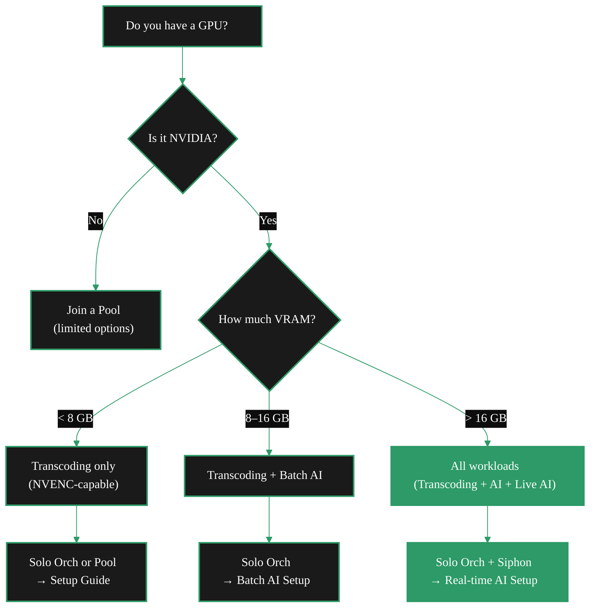
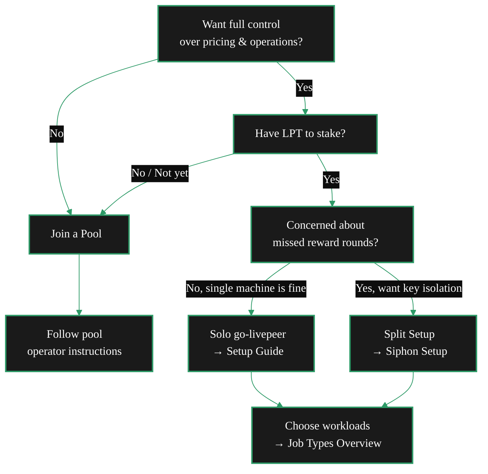

You have a GPU. Or you are thinking about getting one. Now what?

There are three ways to earn on the Livepeer network with compute — and they suit very different situations. This page exists so you do not spend three hours reading the wrong docs before realising you needed a different path. Answer the questions below and you will land on the right starting point in under five minutes.

---

## Three questions to find your path

<AccordionGroup>

<Accordion title="1. Do you want direct control over your node?">
**Yes, I want to set my own prices, choose my workloads, and manage my own setup.**

You want a **solo orchestrator**. You register on-chain, hold your own stake, and earn directly. This is the core Livepeer operator path. Choose between a single-machine setup (full go-livepeer) or a split setup that keeps your keystore secure on a separate machine (Siphon).

**No, I just want to point my GPU at a pool and earn passively.**

You want to be a **pool worker**. You do not stake LPT, you do not manage keys, and you earn via the pool operator's payout schedule. The ops lift is significantly lower. The tradeoff is you depend on the pool operator for payouts, and you cannot set your own prices. → [Join a Pool](/v2/orchestrators/guides/setup-paths/join-a-pool)
</Accordion>

<Accordion title="2. Do you have LPT to stake?">
Solo orchestrators must activate on-chain by staking LPT. There is no minimum enforced by the protocol, but in practice you need enough stake to rank in the top 100 active orchestrators to receive transcoding work. The current competitive stake threshold varies — check [Livepeer Explorer](https://explorer.livepeer.org/orchestrators) for current rankings.

If you do not yet have LPT, **joining a pool** is the practical entry point while you accumulate stake. You can start earning ETH for transcoding work immediately without any on-chain registration.

{/* REVIEW: Confirm whether the "top 100 active orchestrators" limit is still current with Mehrdad/Rick. This figure appears consistently in project audit files but the protocol parameter should be verified on-chain. */}
</Accordion>

<Accordion title="3. How much operational complexity are you comfortable with?">
**Low ops lift — I want it running with minimal ongoing management.**

Start with a pool, or run a full go-livepeer node once you have stake. A single-machine go-livepeer node is the simplest solo path.

**Medium ops lift — I can manage two machines or services.**

Consider the **Siphon split setup**: one secure machine handles your keystore and reward claiming, a separate GPU machine runs go-livepeer and processes workloads. This protects your stake from missed reward rounds if your GPU machine goes down. → [Siphon Setup](/v2/orchestrators/guides/setup-paths/siphon-setup)

**High ops lift — I am running a data centre or multi-node fleet.**

Contact the Livepeer Foundation directly for enterprise onboarding support.
</Accordion>

</AccordionGroup>

---

## The four paths at a glance

| Path | Who it suits | Stake required | Ops lift | Start here |
|---|---|---|---|---|
| **Pool worker** | GPU owner wanting passive income; no protocol ops | No | Low | [Join a Pool →](/v2/orchestrators/guides/setup-paths/join-a-pool) |
| **Solo orchestrator** | Single machine, full control, comfortable with ops | Yes | Medium | [Setup Guide →](/v2/orchestrators/setup/guide) |
| **Split setup (Siphon)** | Reward safety + key isolation; scale GPU machines independently | Yes | Medium | [Siphon Setup →](/v2/orchestrators/guides/setup-paths/siphon-setup) |
| **Enterprise / fleet** | Data centre, multi-node, commercial scale | Yes | High | [Contact Livepeer Foundation →](https://livepeer.org/contact) |

---

## Solo vs pool vs Siphon: what actually differs

It helps to understand what each setup controls before choosing.

<CardGroup cols={3}>

<Card title="Pool worker" icon="users">
**You control:** which pool you join, your GPU hardware, when to switch pools.

**The pool controls:** on-chain registration, staking, pricing, reward calling, payout schedules.

**You earn:** off-chain, via the pool operator's payment system. No on-chain record for your individual GPU.
</Card>

<Card title="Solo orchestrator (go-livepeer)" icon="server">
**You control:** everything. Pricing, stake, workloads, reward calling, uptime.

**Benefit:** full margins, direct on-chain payouts, no intermediary.

**Risk:** if your node goes down mid-round, you miss that round's LPT inflation reward. Everything runs on one machine.
</Card>

<Card title="Split setup (Siphon)" icon="shield-check">
**You control:** everything — but responsibilities are split across two machines.

**Benefit:** keystore stays on a secure, isolated machine. Your GPU machine can restart or go down without you missing rewards. You can scale GPU machines independently.

**Risk:** slightly more complex to set up and keep in sync.
</Card>

</CardGroup>

---

## Choosing your workload type

Before you set up your node, decide what work you want to process. This decision affects your GPU requirements, pricing model, and configuration path.

<Note>
Running both transcoding and AI inference on the same node is supported and common. The two workload types use separate configuration files (`-pricePerUnit` for transcoding, `aiModels.json` for AI) and do not conflict. See [Job Types Overview](/v2/orchestrators/concepts/job-types) for a full comparison.
</Note>

**Workload quick reference:**

| Workload | Min hardware | Pricing | Selection by gateway |
|---|---|---|---|
| Video transcoding | Any NVENC-capable NVIDIA GPU | Wei per pixel; must be below gateway's `-maxPricePerUnit` | Stake + price + performance score |
| Batch AI inference | 4–24 GB VRAM depending on pipeline | Wei per pixel or per request; must be within gateway's capability price range | Capability match + price (`-maxPricePerCapability`) |
| Real-time AI (live-video-to-video) | 8 GB+ VRAM | Per-interval during stream; price advertised per capability | Capability match + latency |

<Tip>
Gateways filter orchestrators by price before routing work. For video transcoding, your `-pricePerUnit` must be at or below the gateway's `-maxPricePerUnit`. For AI, each capability has its own price ceiling configured on the gateway. If your prices are too high for current market rates, you will not receive work even if your hardware is competitive. Check [Configure Pricing](/v2/orchestrators/setup/configure-pricing) before going live.
</Tip>

---

## The full decision tree

---

## Where to go from here

<CardGroup cols={2}>
  <Card title="Join a Pool" icon="users" href="/v2/orchestrators/guides/setup-paths/join-a-pool">
    Contribute your GPU to an existing orchestrator pool. No staking, no on-chain registration, lower barrier to entry.
  </Card>
  <Card title="Solo Setup Guide" icon="server" href="/v2/orchestrators/setup/guide">
    The standard path. Install go-livepeer, register on-chain, and start processing workloads on a single machine.
  </Card>
  <Card title="Siphon Split Setup" icon="shield-check" href="/v2/orchestrators/guides/setup-paths/siphon-setup">
    Keep your keystore on a secure machine; run your GPU on a separate worker machine. The reward-safe path.
  </Card>
  <Card title="Feasibility and Economics" icon="scale-balanced" href="/v2/orchestrators/guides/feasibility/feasibility-economics">
    Not sure if it is worth it? Review the full cost and revenue breakdown before committing to hardware.
  </Card>
</CardGroup>

<Card title="Job Types Overview" icon="list-check" href="/v2/orchestrators/concepts/job-types">
  Understand the four workload categories — transcoding, batch AI, real-time AI, and LLM — before you configure your node.
</Card>
