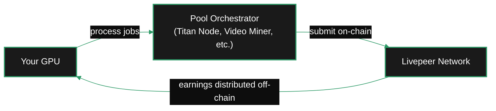
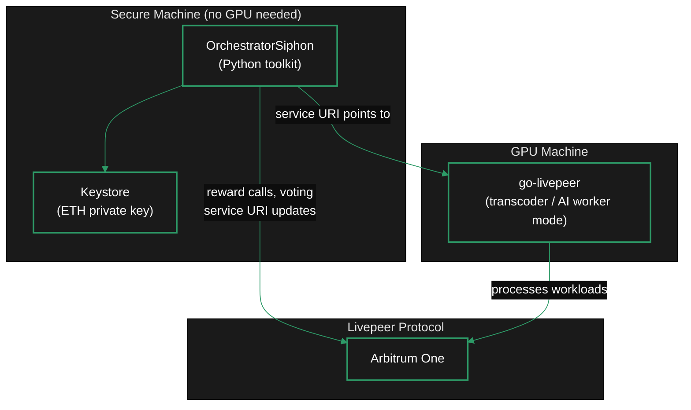

Running a Livepeer orchestrator is not a single path. Your GPU, your available LPT, how much you want to operate versus simply earn, and how much security you need around your keystore all point to different setups. This page helps you choose.

<Note>
  **Just want the quick version?** If you have a GPU and want to earn network fees with minimal protocol operations, [join an existing pool](#path-1-pool-worker) first. You can migrate to a solo orchestrator later.
</Note>

---

## Step 1 — Should you run an orchestrator?

Before choosing a path, answer these two questions honestly.

<AccordionGroup>

<Accordion title="Do I have the GPU hardware?">

| Workload | Minimum GPU | Recommended GPU |
|---|---|---|
| Video transcoding only | NVIDIA RTX 3060 (8 GB VRAM) | RTX 4080 / A4000 |
| Batch AI inference | NVIDIA RTX 3090 / A40 (24 GB VRAM) | RTX 4090 / A100 |
| Real-time AI (Cascade) | NVIDIA RTX 3090 (24 GB VRAM) | RTX 4090 / A100 |
| LLM inference only | NVIDIA RTX 3060 Ti (8 GB VRAM) | RTX 3090+ |

NVIDIA GPUs only. AMD and Apple Silicon are not supported by go-livepeer's AI runner. See [Hardware Requirements](/v2/orchestrators/guides/feasibility/hardware) for the full spec list.
</Accordion>

<Accordion title="Do I need LPT to participate?">

It depends on your chosen path:

- **Pool worker:** No LPT required. You connect your GPU to an existing orchestrator's pool. The pool operator handles staking and on-chain operations.
- **Solo orchestrator / split setup / fleet:** Yes. You need enough bonded LPT to enter the active set (top 100 by stake). Running with too little stake means your node activates but receives very little transcoding work. For AI inference, routing is capability-based rather than stake-weighted, so low-stake AI nodes can still receive jobs.

If you cannot stake enough LPT to compete but want to earn network fees, the pool worker path is specifically designed for you.
</Accordion>

</AccordionGroup>

**If you answered yes to hardware and LPT, continue to Step 2. If you want GPU earnings without protocol ops, skip to [Path 1: Pool Worker](#path-1-pool-worker).**

Not sure if running an orchestrator is economically viable for your specific setup? Review [Feasibility and Economics](/v2/orchestrators/guides/feasibility/feasibility-economics) first.

---

## Step 2 — Choose your path

<CardGroup cols={2}>
  <Card title="Path 1: Pool Worker" icon="swimming-pool" href="#path-1-pool-worker">
    Contribute your GPU to an existing orchestrator's pool. No LPT, no on-chain ops. The pool orchestrator does the protocol work; you do the processing.
  </Card>
  <Card title="Path 2: Solo Orchestrator" icon="microchip" href="#path-2-solo-orchestrator">
    Run the full go-livepeer stack on one machine. Register on-chain, stake LPT, and process workloads. The standard all-in-one path.
  </Card>
  <Card title="Path 3: Split Setup (Siphon)" icon="shield-halved" href="#path-3-split-setup-siphon">
    Separate keystore management and reward calling (Siphon, secure machine) from workload processing (go-livepeer, GPU machine). Adds key isolation and reward reliability.
  </Card>
  <Card title="Path 4: Fleet / Enterprise" icon="server" href="#path-4-fleet--enterprise">
    Multiple GPU nodes behind one orchestrator identity. Data centres and multi-node operators. Requires significant LPT and operational investment.
  </Card>
</CardGroup>

---

## Decision table

| | Pool Worker | Solo Orchestrator | Split Setup (Siphon) | Fleet |
|---|---|---|---|---|
| **LPT required** | No | Yes | Yes | Yes (significant) |
| **GPU required** | Yes | Yes | Yes (GPU machine) | Yes (multiple) |
| **On-chain ops** | Pool handles it | You manage | Siphon handles it | Dedicated ops |
| **Key security** | Pool's keystore | Same machine as GPU | Keystore isolated | Dedicated secure machine |
| **Reward safety** | Pool handles it | Risk if node is busy | Siphon runs independently | Dedicated reward infra |
| **Setup complexity** | Low | Medium | Medium | High |
| **AI inference ready** | Depends on pool | Yes, with aiModels.json | Yes | Yes |
| **Start here** | → [Join a Pool](/v2/orchestrators/setup/join-a-pool) | → [Setup Guide](/v2/orchestrators/setup/guide) | → [Siphon Setup](/v2/orchestrators/setup/siphon-setup) | → Contact us |

---

## Workload type — decide before hardware or pricing

Your path choice intersects with your **workload choice**. The two major workload types have different hardware requirements and routing models.

```
Your GPU Node
     │
     ├── Video Transcoding
     │     • Stake-weighted routing (higher stake → more work)
     │     • GPU for NVENC/NVDEC hardware acceleration
     │     • No VRAM requirement
     │     • Priced per pixel (wei)
     │
     └── AI Inference
           • Capability + price routing (stake is irrelevant)
           • VRAM is the primary constraint
           • Batch AI: request/response (text-to-image, LLM, audio-to-text)
           • Real-time AI: frame-by-frame stream processing (Cascade)
```

**You can run both on the same node.** Most production operators run video transcoding alongside AI inference. If your GPU has limited VRAM (under 16 GB), you can start with LLM inference and `audio-to-text`, which run comfortably at 8–12 GB.

For the full breakdown of what each workload earns and requires, see [Job Types](/v2/orchestrators/concepts/job-types).

---

## Path 1: Pool Worker



**Best for:** GPU owners who want to earn from Livepeer without running protocol infrastructure. Home miners, former ETH miners with idle cards, and operators building toward a solo orchestrator.

You connect your GPU as a transcoder or AI worker that a pool orchestrator points at. The pool operator manages LPT staking, reward calling, on-chain registration, and pricing negotiation. You earn based on the work your GPU processes, with payouts distributed off-chain by the pool.

**What you do NOT need:**
- LPT tokens
- An Arbitrum wallet with ETH for gas
- Knowledge of the Livepeer smart contracts

**What you DO need:**
- An NVIDIA GPU
- Docker and NVIDIA Container Toolkit
- An Ethereum address to receive payouts

<Card title="Join a Pool — Full Guide" icon="swimming-pool" href="/v2/orchestrators/setup/join-a-pool" arrow>
  Step-by-step instructions for joining Titan Node, understanding the connection models, and starting to earn.
</Card>

---

## Path 2: Solo Orchestrator


**Best for:** Operators who want direct control over pricing, uptime, workload selection, and earnings. Comfortable managing a Linux server and GPU infrastructure. Has sufficient LPT to stake competitively.

The standard path. One machine runs the full go-livepeer binary as both orchestrator and transcoder. You register on-chain, bond LPT, configure pricing, set session limits, and start receiving work from gateways.

**Trade-off:** The keystore (your ETH private key) lives on the same machine that processes workloads. If that machine goes down or is compromised, both your rewards and key are affected.

**Start here:**

<Steps>
  <Step title="Hardware and feasibility">
    Review the hardware requirements and do an economics sense-check before setting up.
    [Hardware Requirements](/v2/orchestrators/guides/feasibility/hardware) · [Feasibility and Economics](/v2/orchestrators/guides/feasibility/feasibility-economics)
  </Step>
  <Step title="Install go-livepeer">
    Download and install the go-livepeer binary or Docker image.
    [Setup Guide](/v2/orchestrators/setup/guide)
  </Step>
  <Step title="Register and activate on-chain">
    Bond LPT, register as an orchestrator, and activate your node.
    [Activation Guide](/v2/orchestrators/setup/activate)
  </Step>
  <Step title="Configure pricing and session limits">
    Set your transcoding price, maximum sessions, and AI pipeline configuration.
    [Session Limits](/v2/orchestrators/guides/feasibility/session-limits) · [Pricing Setup](/v2/orchestrators/setup/pricing)
  </Step>
  <Step title="Add AI workloads (optional)">
    Configure aiModels.json to earn fees from AI inference alongside transcoding.
    [Batch AI Setup](/v2/orchestrators/guides/ai-workloads/batch-ai-setup)
  </Step>
</Steps>

---

## Path 3: Split Setup (Siphon)



**Best for:** Operators who want reward reliability, key isolation, or plan to scale GPU machines independently. Also useful as the "start passive, add GPU later" path — you can run Siphon alone earning inflation rewards while you set up GPU infrastructure.

The split setup separates two concerns across different machines:

- **Secure machine** runs [OrchestratorSiphon](https://github.com/Stronk-Tech/OrchestratorSiphon), a community-maintained Python toolkit. Siphon holds your keystore, calls reward each round, votes on proposals, and updates your service URI. Your private key never touches the GPU machine.
- **GPU machine** runs go-livepeer in transcoder or AI worker mode, processing jobs. No keystore on this machine — it cannot sign on-chain transactions directly.

**The reward safety problem this solves:** On a single-machine setup, your orchestrator node is busy processing video segments during active periods. There is a small risk that the node misses a reward call window because it's under load or briefly offline. With Siphon, reward calling runs on a separate, minimal machine dedicated solely to that task. The two machines can go down independently without affecting each other's function.

<Tip>
  You can run OrchestratorSiphon as a passive orchestrator with no GPU attached. Stake LPT, register your service URI as inactive, and collect inflation rewards while you prepare your GPU setup. When ready, update the service URI to point to your go-livepeer GPU machine and go active.
</Tip>

<Card title="Siphon Setup — Full Guide" icon="shield-halved" href="/v2/orchestrators/setup/siphon-setup" arrow>
  Complete installation and configuration guide for OrchestratorSiphon, systemd service setup, and verifying the split works.
</Card>

---

## Path 4: Fleet / Enterprise

**Best for:** Data centres, cloud GPU providers, and operators with multiple GPU machines behind one orchestrator identity.

This path extends the split setup to a fleet model. The architecture is the same as Path 3 — Siphon manages the orchestrator identity; go-livepeer runs on GPU machines — but scaled to multiple GPU machines pointing at a single service URI (typically a load balancer in front of multiple transcoder instances).

<Tip>
  If you are a data centre or enterprise GPU provider, please reach out directly via the [Livepeer Discord](https://discord.gg/livepeer) (#orchestrators channel) or [forum](https://forum.livepeer.org). SPE leads can assist with fleet setup, custom routing configurations, and enterprise onboarding.
</Tip>

{/* REVIEW: Confirm whether there is a dedicated enterprise contact or onboarding path. The Gateways tab mentions data centre outreach but the Orchestrators section lacks a specific contact point. */}

---

## Path matrix — where to go next

| If you are... | Start with | Then continue to |
|---|---|---|
| A home miner with 1–2 GPUs and no LPT | [Join a Pool](/v2/orchestrators/setup/join-a-pool) | [Feasibility](/v2/orchestrators/guides/feasibility/feasibility-economics) (when considering solo) |
| A solo operator wanting full control | [Setup Guide](/v2/orchestrators/setup/guide) | [Session Limits](/v2/orchestrators/guides/feasibility/session-limits) → [Pricing Setup](/v2/orchestrators/setup/pricing) |
| An operator wanting key security + reward safety | [Siphon Setup](/v2/orchestrators/setup/siphon-setup) | [Setup Guide](/v2/orchestrators/setup/guide) (GPU machine) |
| An existing transcoding orchestrator adding AI | [AI Workloads Overview](/v2/orchestrators/concepts/ai-workloads) | [Batch AI Setup](/v2/orchestrators/guides/ai-workloads/batch-ai-setup) |
| Evaluating whether it's worth it at all | [Feasibility and Economics](/v2/orchestrators/guides/feasibility/feasibility-economics) | [Benchmarking](/v2/orchestrators/guides/feasibility/benchmarking) |
| A data centre / multi-node operator | [Contact the team](https://discord.gg/livepeer) | Fleet Ops (advanced) |

---

## Watch: Orchestrator setup overview

<Frame>
  <iframe
    width="100%"
    height="400"
    src="https://www.youtube.com/embed/7Ql3S7OB4l4"
    title="Livepeer Orchestrator Setup — Full Walkthrough"
    frameBorder="0"
    allow="accelerometer; autoplay; clipboard-write; encrypted-media; gyroscope; picture-in-picture"
    allowFullScreen
  />
</Frame>

{/* REVIEW: Confirm this YouTube video ID is current and represents an accurate setup walkthrough. Titan Node or Livepeer Inc have published orchestrator setup content. Rick / SPE leads to provide canonical video IDs. */}

---

<CardGroup cols={2}>
  <Card title="Feasibility and Economics" icon="scale-balanced" href="/v2/orchestrators/guides/feasibility/feasibility-economics">
    Cost breakdown, revenue expectations, and the decision matrix before committing to setup.
  </Card>
  <Card title="Job Types" icon="layer-group" href="/v2/orchestrators/concepts/job-types">
    Video transcoding, batch AI, real-time AI, and LLM — what each workload earns and requires.
  </Card>
  <Card title="Hardware Requirements" icon="microchip" href="/v2/orchestrators/guides/feasibility/hardware">
    GPU tiers, VRAM requirements, driver versions, and the pre-launch checklist.
  </Card>
  <Card title="Setup Guide" icon="rocket" href="/v2/orchestrators/setup/guide">
    Install go-livepeer, register on-chain, and activate your orchestrator node.
  </Card>
</CardGroup>
