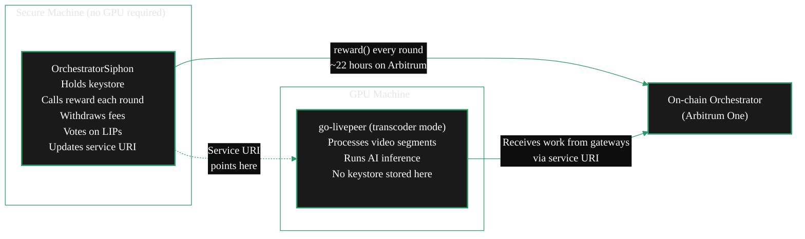

Running your orchestrator keystore on the same machine as your GPU workloads creates two risks. If the GPU machine is busy or reboots mid-round, you miss that round's LPT inflation reward — and missed rewards compound against you over time. And a machine actively processing untrusted media data is not the safest place for a key that controls your staked LPT.

The **split setup** solves both. **OrchestratorSiphon** runs on a small, secure machine and handles all on-chain actions: reward calling, fee withdrawal, governance voting, and service URI updates. Your GPU machine runs go-livepeer in transcoder mode and does nothing but process work — it never holds the keystore.

The two machines are independent. Your GPU machine can restart, be replaced, or be taken offline for maintenance without interrupting reward claims. And if you want to add a second GPU machine later, you do so without touching your secure machine at all.

---

## Architecture overview



| Machine | What it does | GPU required |
|---|---|---|
| Secure machine | Keystore, reward calling, on-chain actions | No |
| GPU machine | Segment processing, AI inference, ticket redemption | Yes |

---

## When to choose this setup

<CardGroup cols={2}>

<Card title="Use Siphon when..." icon="shield-check">
  You want reward safety independent of GPU uptime, key isolation from workload processing, or you plan to run multiple GPU machines behind one orchestrator identity. Also the right entry path if you want to start earning inflation rewards before your GPU infrastructure is ready.
</Card>

<Card title="Use full go-livepeer instead when..." icon="server">
  You want the simplest possible single-machine setup and are comfortable managing reward calling alongside workloads. The standard setup guide covers this path.
</Card>

</CardGroup>

<Tip>
  You can run Siphon alone — with no GPU machine — to earn LPT inflation rewards while you prepare your GPU infrastructure. When ready, deploy go-livepeer in transcoder mode and point your service URI at the GPU machine. No changes to your keystore or on-chain registration are needed.
</Tip>

---

## Prerequisites

| Requirement | Secure machine | GPU machine |
|---|---|---|
| OS | Linux (Ubuntu 20.04+) | Linux with NVIDIA GPU |
| Python | python3 + pip | Not required |
| Network | Outbound to Arbitrum One RPC | Static IP or stable DNS entry |
| Ethereum | Orchestrator keystore + ETH for gas | Small ETH balance for ticket redemption |
| Stake | LPT staked on-chain | Not applicable |

The secure machine does not need a GPU. A small VPS (1 vCPU, 512 MB RAM) is sufficient. The important properties are stability, restricted access, and that you are the only one who can reach it.

---

## Part 1: Secure machine — install and configure OrchestratorSiphon

<Steps>

<Step title="Clone the repository">
```bash
git clone https://github.com/Stronk-Tech/OrchestratorSiphon.git
cd OrchestratorSiphon
```

<Card title="OrchestratorSiphon — Stronk-Tech/OrchestratorSiphon" icon="github" href="https://github.com/Stronk-Tech/OrchestratorSiphon">
  A lightweight Python toolkit for managing a Livepeer orchestrator keystore.
</Card>
</Step>

<Step title="Install Python dependencies">
A virtual environment is the recommended approach on all Ubuntu versions:

```bash
python3 -m venv .venv
source .venv/bin/activate
pip install web3 eth-utils setuptools
```

On **Ubuntu 24.04+** without a virtualenv, use `--break-system-packages`:

```bash
python3 -m pip install --break-system-packages web3 eth-utils setuptools
```

Verify the installation:

```bash
python3 -m pip show web3 requests urllib3
```

If you see a `RequestsDependencyWarning` about urllib3 or chardet:

```bash
pip install --upgrade "requests>=2.31" "urllib3>=2.0" web3
```
</Step>

<Step title="Configure config.ini">
Open the provided configuration file:

```bash
nano config.ini
```

The essential fields are:

```ini
[keystore1]
; Path to your Ethereum keystore file (the UTC-- file)
keystore = /path/to/keystore/UTC--<timestamp>--<address>

; Keystore password or path to a file containing it.
; Leave empty to be prompted interactively — more secure.
password =

; Your orchestrator's on-chain Ethereum address
source_address = 0xYourOrchestratorAddress

; Address to receive ETH fee withdrawals
receiver_address_eth = 0xYourReceiver

; Address to receive LPT bond transfers
receiver_address_lpt = 0xYourReceiver

[thresholds]
lpt_threshold  = 100     ; Trigger TransferBond when pending LPT exceeds this
eth_threshold  = 0.20    ; Trigger WithdrawFees when pending ETH exceeds this
eth_minval     = 0.020   ; Keep at least this much ETH for gas
eth_warn       = 0.010   ; Warn when ETH balance drops below this

[rpc]
l2 = https://arb1.arbitrum.io/rpc   ; Arbitrum One RPC endpoint
```

If you run multiple orchestrators, duplicate the `[keystore1]` block and name the second section `[keystore2]`.

<Note>
  Every config value can alternatively be passed as an environment variable. The config file comments show the corresponding variable name for each setting. Environment variables always take precedence over the file.
</Note>

<Warning>
  Never share your keystore or password with anyone. If you are uncertain about what the script does with your key, search `source_private_key` in the Python source files — the repository README explicitly points to these locations. If in doubt, use the official go-livepeer binary to manage rewards instead.
</Warning>
</Step>

<Step title="Test manually before going to production">
Run Siphon once to confirm it can decrypt your keystore and connect to Arbitrum. If you left `password` empty, it will prompt you:

```bash
# Using virtualenv:
.venv/bin/python3 OrchestratorSiphon.py

# Using system interpreter:
python3 OrchestratorSiphon.py
```

Enter your password when asked, then enter `0` to launch standard mode. You should see output showing your orchestrator's current state (pending rewards, ETH balance, current round).

If Siphon cannot connect to the RPC endpoint, check your network configuration and verify the Arbitrum RPC URL is reachable from this machine.
</Step>

<Step title="Set up as a systemd service">
For production use, register Siphon as a systemd service so it restarts automatically after reboots.

Create `/etc/systemd/system/orchSiphon.service`:

```ini
[Unit]
Description=OrchestratorSiphon — Livepeer keystore manager
After=network-online.target
Wants=network-online.target

[Service]
Type=simple
User=<your-linux-user>
WorkingDirectory=/path/to/OrchestratorSiphon
ExecStart=/path/to/OrchestratorSiphon/.venv/bin/python3 -u OrchestratorSiphon.py
Restart=on-failure
RestartSec=10s
StandardOutput=journal
StandardError=journal

[Install]
WantedBy=multi-user.target
```

Enable and start:

```bash
sudo systemctl daemon-reload
sudo systemctl enable orchSiphon
sudo systemctl start orchSiphon
sudo systemctl status orchSiphon
```

Follow logs live:

```bash
journalctl -u orchSiphon -f
```

<Note>
  If you are storing the password in a file rather than entering it interactively, ensure that file has permissions `600` and is only readable by the service user. Alternatively, pass the password via an environment variable using systemd's `EnvironmentFile=` directive, pointing to a protected file.
</Note>
</Step>

</Steps>

---

## Part 2: GPU machine — install go-livepeer in transcoder mode

<Steps>

<Step title="Install go-livepeer">
Follow the standard installation guide on your GPU machine. You only need the binary — you will not perform on-chain registration, as your orchestrator is already registered via the keystore on your secure machine.

<Card title="go-livepeer Installation Guide" icon="book" href="/v2/orchestrators/setup/guide">
  Standard installation steps. Follow until the binary is installed and your GPU is confirmed visible.
</Card>
</Step>

<Step title="Start go-livepeer in transcoder mode">
Pass `-transcoder` (not `-orchestrator`). The `-orchAddr` flag identifies which orchestrator endpoint this GPU machine is serving under:

```bash
livepeer \
    -transcoder \
    -orchAddr <your-service-uri-host>:8935 \
    -nvidia 0 \
    -maxSessions 10 \
    -network arbitrum-one-mainnet
```

Replace `<your-service-uri-host>` with the hostname or IP of this machine (or its public-facing load balancer). For AI workloads, add your `aiModels.json` configuration:

```bash
livepeer \
    -transcoder \
    -orchAddr <your-service-uri-host>:8935 \
    -nvidia 0 \
    -maxSessions 10 \
    -aiModels /path/to/aiModels.json \
    -network arbitrum-one-mainnet
```

<Note>
  In transcoder mode, go-livepeer does not look for or use an Ethereum keystore. It handles the GPU-side of workload processing only. All on-chain identity management stays with Siphon on your secure machine.
</Note>
</Step>

<Step title="Update your service URI to point to this machine">
Your service URI is what gateways use to find your node and route work to it. It must resolve to your GPU machine's address.

To update the service URI on-chain, trigger OrchestratorSiphon's interactive mode on your secure machine. While Siphon is running, send it a `SIGINT` (Ctrl+C) signal — this switches it to interactive mode rather than exiting. Select the service URI update option from the menu.

Alternatively, if you have go-livepeer running in full orchestrator mode on any machine with your keystore, you can use `livepeer_cli` to update the service address directly.

{/* REVIEW: Confirm the exact interactive mode menu options in OrchestratorSiphon for updating service URI. The README describes triggering interactive mode via SIGINT/SIGQUIT/SIGTSTP but does not enumerate all menu actions. Rick or Stronk-Tech community to verify the current menu structure. */}

After updating, verify the change is reflected on-chain by checking Livepeer Explorer:

```
https://explorer.livepeer.org/accounts/<your-orchestrator-address>/orchestrating
```
</Step>

</Steps>

---

## Verifying the split is working

Once both machines are running, confirm each side is operating correctly:

**Secure machine (Siphon):**
```bash
# Check that rewards are being called
journalctl -u orchSiphon --since "24 hours ago" | grep -i "reward\|round"
```

You should see a reward call for each round (~once every 22 hours). Check the on-chain record on the Explorer.

**GPU machine (go-livepeer):**
```bash
# Look for incoming work in go-livepeer logs
journalctl -u livepeer --since "1 hour ago" | grep -i "transcode\|segment\|session"
```

You should see transcoding activity if gateways are routing work to you. If you see no incoming sessions, check your service URI resolves correctly and port 8935 is open.

---

## Day-to-day operations

With the split setup running correctly, your ongoing workload is minimal:

**Secure machine — mostly automatic:**
- Siphon calls `reward()` each round with no intervention needed
- ETH fees are swept to your receiver address when the threshold is met
- Check `journalctl -u orchSiphon` periodically for errors
- Keep your ETH balance above `eth_warn` — top up if Siphon starts logging balance warnings

**GPU machine — standard orchestrator ops:**
- Monitor workload activity and metrics
- Restart cleanly after upgrades or hardware changes
- Ensure your IP or DNS entry stays valid so the service URI resolves

**Neither machine** needs to know about or interact with the other to keep your rewards safe. That is the point.

---

## Scaling: adding a second GPU machine

To add a second GPU machine, simply:

1. Install go-livepeer in transcoder mode on the new machine
2. Point `-orchAddr` at the same service URI (or a load balancer in front of both GPU machines)
3. Your orchestrator's advertised capacity increases as gateways observe higher throughput

Your Siphon configuration on the secure machine does not change. Your stake, on-chain identity, and reward schedule are unaffected.

---

## Troubleshooting

<AccordionGroup>

<Accordion title="Siphon is failing to call rewards — gas error">
Your orchestrator wallet ETH balance has dropped below the amount needed for gas. The `eth_minval` threshold is meant to prevent this, but if Arbitrum gas spikes or fees accumulate faster than expected, the wallet can run dry.

Check the balance in `journalctl -u orchSiphon` output, then top up your orchestrator address with ETH on Arbitrum One. Siphon will resume automatically.
</Accordion>

<Accordion title="GPU machine is not receiving any work">
1. Verify your service URI on-chain resolves to your GPU machine's IP/hostname
2. Check port 8935 is open and reachable from the internet (run `curl -v https://<your-service-uri>:8935/status` from a different machine)
3. Confirm go-livepeer started successfully in transcoder mode — check for GPU detection in the startup log
4. Check [Livepeer Explorer](https://explorer.livepeer.org/orchestrators) to confirm your orchestrator is in the active set and the service URI is listed correctly
5. Confirm your pricing is within the range gateways will accept — if `-pricePerUnit` is set too high, no work is routed to you regardless of uptime
</Accordion>

<Accordion title="I need to change the GPU machine's IP address">
1. Update your DNS record or IP configuration first
2. Trigger Siphon's interactive mode and update the service URI to the new address
3. Wait a few minutes for the on-chain update to propagate
4. Verify the new URI appears on the Explorer before testing incoming work
</Accordion>

<Accordion title="Can I run Siphon without the GPU machine online?">
Yes. Siphon manages on-chain actions independently. Your orchestrator continues claiming LPT inflation rewards each round regardless of whether the GPU machine is running. The only consequence of the GPU machine being offline is that gateways cannot route work to you — your staked LPT and reward schedule are unaffected.
</Accordion>

</AccordionGroup>

---

## Related

<CardGroup cols={2}>
  <Card title="Earnings Overview" icon="coins" href="/v2/orchestrators/concepts/earnings">
    How LPT inflation rewards and transcoding fees work — the two revenue streams Siphon helps protect.
  </Card>
  <Card title="Reward Calling Guide" icon="clock" href="/v2/orchestrators/guides/staking/rewards-and-fees">
    Reward calling mechanics, gas cost breakdown, and what happens if you miss a round.
  </Card>
  <Card title="Feasibility and Economics" icon="scale-balanced" href="/v2/orchestrators/guides/feasibility/feasibility-economics">
    Full cost and revenue analysis — worth reading before committing to the two-machine setup.
  </Card>
  <Card title="Navigator" icon="map" href="/v2/orchestrators/guides/setup-paths/find-your-path">
    Not sure if Siphon is the right path for you? Return to the decision guide.
  </Card>
</CardGroup>
