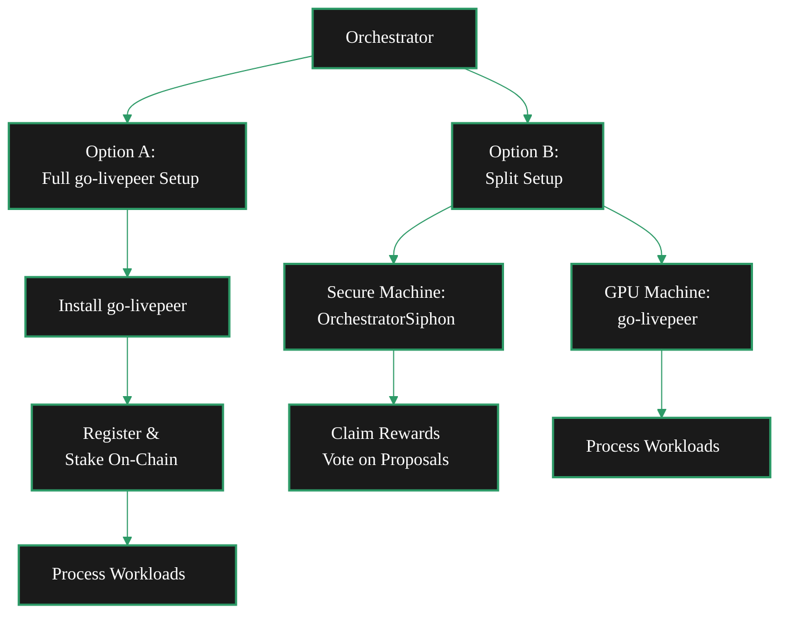

As an orchestrator, you run a node that provides GPU compute to the Livepeer network. Orchestrators process workloads submitted by gateways - transcoding video, running AI inference, or executing BYOC containers - and earn LPT rewards and ETH fees in return.

There are two approaches depending on whether you want full control of a single setup or prefer to separate rewards management from workload processing.

## Pick Your Setup

<Columns cols={2}>
  <Card title="Full go-livepeer Setup" icon="microchip" href="#option-a-full-go-livepeer-setup" arrow>
    Run the full go-livepeer binary on one machine - register on-chain, stake LPT, and process workloads directly.
  </Card>
  <Card title="Split Setup (Siphon + go-livepeer)" icon="shield-check" href="#option-b-split-setup-orchestratorsiphon--go-livepeer" arrow>
    Separate rewards and keystore management from workload processing across two machines. Avoid missing rewards.
  </Card>
</Columns>

---

---

## Option A: Full go-livepeer Setup

The standard path runs the full go-livepeer binary, registers on-chain, and actively processes workloads. Everything runs on one machine. This is the path for operators who want a straightforward, all-in-one orchestrator.

<Steps>
  <Step title="Install go-livepeer" icon="download">
    Build from source or download a release binary. The go-livepeer CLI includes everything needed to run as an orchestrator - no additional tooling required.

    <Card title="go-livepeer Repository" icon="github" href="https://github.com/livepeer/go-livepeer" arrow horizontal>
      Source code, releases, and build instructions.
    </Card>
  </Step>
  <Step title="Register and activate on-chain" icon="link">
    Use the go-livepeer CLI to register as an orchestrator on the Livepeer protocol. You'll need to stake LPT and activate your node on the Arbitrum L2.

    <Card title="go-livepeer Technical Docs" icon="book-open" href="https://github.com/livepeer/go-livepeer/tree/master/doc" arrow horizontal>
      Docs for networking, GPU setup, payments, and Ethereum/Arbitrum configuration.
    </Card>
  </Step>
  <Step title="Configure your GPU and start processing" icon="microchip">
    Set up your GPU configuration and start your orchestrator. Once active, your node receives workloads from gateways and processes them.
  </Step>
</Steps>

---

## Option B: Split Setup (OrchestratorSiphon + go-livepeer)

The split setup separates two concerns across different machines:

- **Secure machine** - runs **OrchestratorSiphon**, a lightweight Python toolkit that manages your orchestrator keystore. Handles on-chain actions like claiming rewards, voting on proposals, and updating your service URI. Your keystore stays on one secure, isolated machine.
- **GPU machine** - runs **go-livepeer** to actively process workloads. No keystore needed on this box.

This avoids a common problem: missing rewards because your orchestrator node was busy processing workloads or went down temporarily. With the split setup, rewards claiming runs independently on its own machine.

<Columns cols={2}>
  <Card title="OrchestratorSiphon" icon="github" href="https://github.com/Stronk-Tech/OrchestratorSiphon" arrow>
    Lightweight keystore management - claim rewards, vote on proposals, update service URI. Runs on your secure machine.
  </Card>
  <Card title="go-livepeer" icon="github" href="https://github.com/livepeer/go-livepeer" arrow>
    Deploy on your GPU machine for active workload processing. Point your service URI to this box.
  </Card>
</Columns>

<Tip>
  You can start with OrchestratorSiphon alone as a passive orchestrator to earn rewards while you set up your GPU infrastructure. When you're ready to process workloads, deploy go-livepeer on a separate machine and update your service URI to point to it.
</Tip>

---

## Not sure which setup?

If you're new to Livepeer and just want to contribute a GPU without running a full orchestrator, consider [joining an existing pool](/v2/orchestrators/quickstart/join-a-pool) instead. The [Orchestrator Quickstart](/v2/orchestrators/quickstart/overview) has a decision tree to help you choose.
