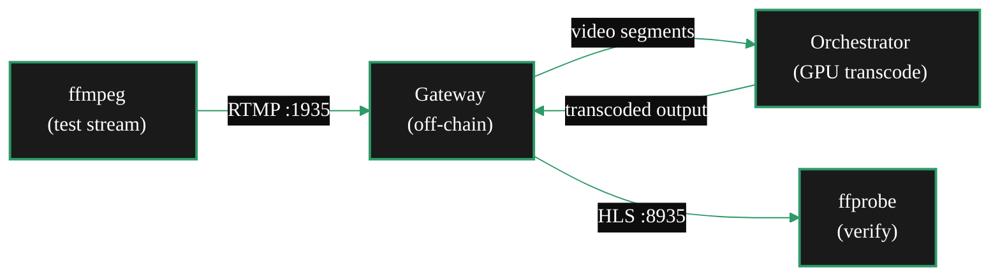

import { CustomDivider } from '/snippets/components/primitives/divider.jsx'
import { LinkArrow } from '/snippets/components/primitives/links.jsx'
import { StyledTable, TableRow, TableCell } from '/snippets/components/layout/tables.jsx'
import { StyledSteps, StyledStep } from '/snippets/components/layout/steps.jsx'

<Tip>
  Both tests run entirely off-chain. No blockchain, no staking, no ETH. The only goal is confirming your GPU works with Livepeer before committing to production setup.
</Tip>

Two smoke tests on this page: **video transcoding** (20-30 min) and **AI inference** (35-65 min). Both run with Docker only. Complete the video test first - it shares the Docker prerequisites with the AI test.

<Note>
  Use this page to verify hardware. Continue to the <LinkArrow href="/v2/orchestrators/setup/guide" label="Setup Guide" newline={false} /> after these tests when you are ready for on-chain activation and earning.
</Note>

<CustomDivider middleText="Prerequisites" />

## Prerequisites

Confirm each item before starting:

<StyledTable variant="bordered">
  <thead>
    <TableRow header>
      <TableCell header>Requirement</TableCell>
      <TableCell header>Verify with</TableCell>
      <TableCell header>Notes</TableCell>
    </TableRow>
  </thead>
  <tbody>
    <TableRow>
      <TableCell>NVIDIA GPU</TableCell>
      <TableCell>`nvidia-smi`</TableCell>
      <TableCell>Note your VRAM total. 24 GB needed for AI diffusion; 8 GB minimum for LLM alternative.</TableCell>
    </TableRow>
    <TableRow>
      <TableCell>Docker Engine</TableCell>
      <TableCell>`docker --version`</TableCell>
      <TableCell>Docker Engine 24+ recommended.</TableCell>
    </TableRow>
    <TableRow>
      <TableCell>NVIDIA Container Toolkit</TableCell>
      <TableCell>`docker run --rm --gpus all nvidia/cuda:12.0.0-base-ubuntu22.04 nvidia-smi`</TableCell>
      <TableCell>Install the toolkit before continuing when this check fails.</TableCell>
    </TableRow>
    <TableRow>
      <TableCell>ffmpeg (video test only)</TableCell>
      <TableCell>`ffmpeg -version`</TableCell>
      <TableCell>Install: `apt-get install ffmpeg`</TableCell>
    </TableRow>
    <TableRow>
      <TableCell>Linux OS</TableCell>
      <TableCell>`uname -a`</TableCell>
      <TableCell>Required for the AI test. Video test also works on WSL2 and macOS Docker.</TableCell>
    </TableRow>
  </tbody>
</StyledTable>

<CustomDivider middleText="Video Transcoding Test" />

## Video transcoding test

**What this proves:** the orchestrator accepts video segments, transcodes them on the GPU, and delivers HLS output.

<StyledSteps>

  <StyledStep title="Pull go-livepeer">

    ```bash icon="terminal" filename="pull"
    docker pull livepeer/go-livepeer:stable
    ```

    Verify:

    ```bash icon="terminal" filename="verify"
    docker run --rm livepeer/go-livepeer:stable livepeer -version
    ```

    Expected: `Livepeer Node Version: v0.8.x`

  </StyledStep>

  <StyledStep title="Start a local orchestrator (off-chain)">

    In a terminal, start the orchestrator. `-network offchain` means no blockchain dependency - registration is local only:

    ```bash icon="terminal" filename="start-orchestrator"
    docker run -d \
      --name lp-orch-test \
      --gpus all \
      --network host \
      livepeer/go-livepeer:stable \
      -orchestrator \
      -transcoder \
      -network offchain \
      -nvidia 0 \
      -serviceAddr 127.0.0.1:8936 \
      -cliAddr 127.0.0.1:7936
    ```

    Watch for GPU detection:

    ```bash icon="terminal" filename="check-gpu"
    docker logs lp-orch-test 2>&1 | grep -i "nvidia\|gpu\|transcode"
    ```

    Expected:
    ```text icon="code" title="Expected GPU detection log"
    Transcoding on Nvidia GPU 0
    ```

  </StyledStep>

  <StyledStep title="Start a local gateway (off-chain, same machine)">

    In a second terminal, start a gateway pointing at the local orchestrator:

    ```bash icon="terminal" filename="start-gateway"
    docker run -d \
      --name lp-gw-test \
      --network host \
      livepeer/go-livepeer:stable \
      -gateway \
      -network offchain \
      -orchAddr http://127.0.0.1:8936 \
      -rtmpAddr 0.0.0.0:1935 \
      -httpAddr 0.0.0.0:8935 \
      -cliAddr 127.0.0.1:7935
    ```

    Verify the gateway is reachable:

    ```bash icon="terminal" filename="check-gateway"
    curl http://127.0.0.1:8935/status
    ```

    Expected: a JSON response (content may vary - any response confirms the gateway is up).

  </StyledStep>

  <StyledStep title="Send a test stream">

    Send a synthetic test pattern as an RTMP stream. This simulates a source stream from OBS or a camera:

    ```bash icon="terminal" filename="send-stream"
    ffmpeg -re \
      -f lavfi -i testsrc=size=1280x720:rate=30 \
      -c:v libx264 \
      -preset ultrafast \
      -tune zerolatency \
      -f flv \
      rtmp://127.0.0.1:1935/test_stream
    ```

    Leave this running for 10-15 seconds, then stop it with `Ctrl+C`.

  </StyledStep>

  <StyledStep title="Verify transcoded output">

    Check the gateway delivered HLS output:

    ```bash icon="terminal" filename="check-hls"
    ffprobe http://127.0.0.1:8935/stream/test_stream.m3u8
    ```

    Expected: stream metadata including video codec and duration. Any valid ffprobe output confirms transcoding completed.

    Check the orchestrator logs for job confirmation:

    ```bash icon="terminal" filename="check-orch-logs"
    docker logs lp-orch-test 2>&1 | grep -i "got segment\|transcode result"
    ```

    Expected:
    ```text icon="code" title="Expected transcoding log"
    Got segment for stream test_stream
    Transcode result OK
    ```

  </StyledStep>

  <StyledStep title="Clean up">

    ```bash icon="terminal" filename="cleanup"
    docker stop lp-orch-test lp-gw-test
    docker rm lp-orch-test lp-gw-test
    ```

  </StyledStep>

</StyledSteps>

### Video flow summary



The gateway received the RTMP stream, split it into segments, routed them to the orchestrator, the orchestrator transcoded each segment on the GPU, and the gateway reassembled the output as an HLS stream. The `-network offchain` flag kept the test local and bypassed blockchain interaction.

**GPU transcoding works on this machine.** Continue to the AI test, or skip to the <LinkArrow href="/v2/orchestrators/setup/guide" label="Setup Guide" newline={false} /> for production configuration.

<CustomDivider middleText="AI Inference Test" />

## AI inference test

<Note>
  The diffusion test requires 24 GB VRAM. For GPUs with 8-16 GB VRAM, skip to the LLM alternative below.
</Note>

**What this proves:** the AI runner container downloads and serves a warm model, and the orchestrator routes inference requests correctly.

**Time estimate:** 35-65 minutes - most of this is the model download (~6 GB for SDXL-Lightning). The actual inference test takes under 2 minutes once the model is loaded.

<StyledSteps>

  <StyledStep title="Pull the AI runner container">

    ```bash icon="terminal" filename="pull-ai-runner"
    docker pull livepeer/ai-runner:latest
    ```

  </StyledStep>

  <StyledStep title="Create the model directory and aiModels.json">

    ```bash icon="terminal" filename="create-dirs"
    mkdir -p ~/.lpData/models
    ```

    Create `~/.lpData/aiModels.json`:

    ```json icon="code" filename="~/.lpData/aiModels.json"
    [
      {
        "pipeline": "text-to-image",
        "model_id": "ByteDance/SDXL-Lightning",
        "warm": true,
        "price_per_unit": 4768371
      }
    ]
    ```

    `warm: true` loads the model into VRAM at startup - this is required for the test to work reliably. `price_per_unit` is set but not enforced in off-chain mode; include it so the config is production-ready.

  </StyledStep>

  <StyledStep title="Start the orchestrator with AI worker (off-chain)">

    ```bash icon="terminal" filename="start-ai-orch"
    docker run -d \
      --name lp-ai-test \
      --gpus all \
      --network host \
      -v ~/.lpData/:/root/.lpData/ \
      -v /var/run/docker.sock:/var/run/docker.sock \
      livepeer/go-livepeer:stable \
      -orchestrator \
      -transcoder \
      -network offchain \
      -nvidia 0 \
      -serviceAddr 127.0.0.1:8935 \
      -cliAddr 127.0.0.1:7935 \
      -aiWorker \
      -aiModels /root/.lpData/aiModels.json \
      -aiModelsDir /root/.lpData/models
    ```

    <Warning>
      `-aiModelsDir` must be the **host** path (`~/.lpData/models`), not a path inside the container. go-livepeer uses Docker-out-of-Docker to spawn AI runner containers and mounts this path directly on the host. The `-v /var/run/docker.sock:/var/run/docker.sock` mount is required for this to work.
    </Warning>

  </StyledStep>

  <StyledStep title="Wait for model download and warm load">

    Watch the startup logs:

    ```bash icon="terminal" filename="watch-startup"
    docker logs -f lp-ai-test 2>&1 | grep -i "model\|warm\|pipeline\|download\|error"
    ```

    The first start downloads model weights from HuggingFace (~6 GB). Expected progression:
    ```text icon="code" title="Expected warm model log"
    Starting AI worker
    Downloading ByteDance/SDXL-Lightning...
    Pipeline text-to-image started
    Warm model loaded: ByteDance/SDXL-Lightning
    ```

    **Wait until "Warm model loaded" appears before proceeding.** This takes 5 to 30 minutes depending on connection speed and GPU.

    Also verify the AI runner container started:

    ```bash icon="terminal" filename="check-containers"
    docker ps | grep -i "ai-runner\|livepeer"
    ```

    Both `lp-ai-test` and an AI runner container should show `Up`.

  </StyledStep>

  <StyledStep title="Test inference locally">

    Send a test inference request to the orchestrator:

    ```bash icon="terminal" filename="test-inference"
    curl -X POST http://127.0.0.1:8935/text-to-image \
      -H "Content-Type: application/json" \
      -d '{
        "model_id": "ByteDance/SDXL-Lightning",
        "prompt": "a test image of a mountain at sunrise",
        "width": 512,
        "height": 512,
        "num_inference_steps": 4
      }' \
      -o test-output.png \
      --max-time 30
    ```

    {/* TODO: Confirm the current direct local inference endpoint path for go-livepeer. */}

    Verify:

    ```bash icon="terminal" filename="check-output"
    file test-output.png
    ```

    Expected: `test-output.png: PNG image data` with a non-zero file size. Any valid PNG confirms AI inference works end-to-end.

  </StyledStep>

  <StyledStep title="Clean up">

    ```bash icon="terminal" filename="cleanup-ai"
    docker stop lp-ai-test
    docker rm lp-ai-test
    ```

    The downloaded model weights remain in `~/.lpData/models/` for reuse in production setup.

  </StyledStep>

</StyledSteps>

Use `http://llm_runner:8000` as the `url` value in `aiModels.json` when you switch to the Ollama-based LLM path.

<AccordionGroup>
  <Accordion title="LLM alternative for 8-16 GB VRAM GPUs" icon="microchip">
    The `llm` pipeline uses the Ollama runner instead of `livepeer/ai-runner`. It runs quantised LLMs within 8 GB VRAM.

    Pull the Ollama runner:

    ```bash icon="terminal" filename="pull-ollama"
    docker pull tztcloud/livepeer-ollama-runner:0.1.1
    docker pull ollama/ollama:latest
    ```

    Create a Docker volume and pull a model:

    ```bash icon="terminal" filename="ollama-setup"
    docker volume create ollama
    docker run -d --name ollama --gpus all \
      -v ollama:/root/.ollama \
      ollama/ollama:latest

    docker exec -it ollama ollama pull llama3.1:8b
    ```

    Add the LLM entry to `aiModels.json`:

    ```json icon="code" filename="~/.lpData/aiModels.json"
    [
      {
        "pipeline": "llm",
        "model_id": "meta-llama/Meta-Llama-3.1-8B-Instruct",
        "warm": true,
        "price_per_unit": 0.18,
        "currency": "USD",
        "pixels_per_unit": 1000000,
        "url": "http://llm_runner:8000"
      }
    ]
    ```

    For the full LLM pipeline setup including the Docker network configuration, see <LinkArrow href="/v2/orchestrators/guides/ai-and-job-workloads/llm-pipeline-setup" label="LLM Pipeline Setup" newline={false} />.
  </Accordion>
</AccordionGroup>

### AI flow summary

The orchestrator started in off-chain mode with the AI worker enabled. On first start, `livepeer/ai-runner` was spawned as a child Docker container via Docker-out-of-Docker, downloaded model weights from HuggingFace, and loaded them into GPU VRAM. The test inference request travelled from curl to the orchestrator, through the AI runner container, and returned a generated PNG.

**AI inference works on this machine.** Model weights remain cached in `~/.lpData/models/` for production use.

<CustomDivider />

## Next steps

<CardGroup cols={2}>
  <Card title="Setup Guide" icon="gear" href="/v2/orchestrators/setup/guide">
    Configure for production: on-chain setup, staking, Arbitrum activation, reward calling.
  </Card>
  <Card title="Operator Rationale" icon="scale-balanced" href="/v2/orchestrators/guides/operator-considerations/operator-rationale">
    Still evaluating? Review the cost-benefit analysis before committing.
  </Card>
  <Card title="Join a Pool" icon="users" href="/v2/orchestrators/guides/deployment-details/join-a-pool">
    Earn without full solo setup by contributing GPU capacity to a pool.
  </Card>
  <Card title="Workload Options" icon="list-check" href="/v2/orchestrators/guides/ai-and-job-workloads/workload-options">
    Compare workloads and determine which pipelines fit your hardware.
  </Card>
</CardGroup>
