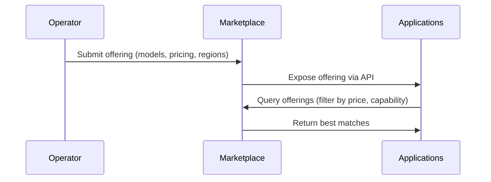

import { PreviewCallout } from '/snippets/components/domain/SHARED/previewCallouts.jsx'

<PreviewCallout />

## Publishing as an Orchestrator (MOVE ME)

Orchestrators publish compute offerings showing:

### **GPU Inventory**

- 4090
- A40
- L40S
- V100

### **Model Compatibility**

- TensorRT support
- Torch Compile accelerations

### **Benchmarks**

- Frames per second
- Tokens per second
- Latency per model

## Marketplace Submission Workflow

## Updating Offerings

Operators can dynamically update:

- Pricing
- Model support
- Pipeline versions
- GPU availability
  Performance metrics

Updates propagate automatically to Marketplace consumers.
