<br/>
### Layout 1
<AccordionGroup>
<Accordion title="1. Requirements Check" icon="clipboard-check">
    Check hardware, network, and software requirements.
  </Accordion>
  <Accordion title="2. Deploy the Gateway Service" icon="rocket">
    You'll set up:
    - API server
    - Routing engine
    - Capability registry
    - Pricing configuration

    Gateways can be deployed via:
    - Docker
    - Kubernetes
    - Bare-metal services

  </Accordion>

  <Accordion title="3. Connect to Orchestrators" icon="link">
    Gateways select orchestrators based on:
    - GPU type (A40, 4090, L40S, etc.)
    - Model compatibility
    - Performance metrics
    - Reliability scores
    - Pricing

    Gateways must maintain active communication channels with orchestrator nodes.

  </Accordion>

{' '}
<Accordion title="4. Configure Capabilities" icon="gear">
  Your Gateway must declare: - Supported models (diffusion, ControlNet,
  IPAdapter) - Supported pipelines (ComfyStream, Daydream, BYOC containers) -
  Region/latency zones - Fallback and load-balancing rules
</Accordion>

  <Accordion title="5. Set Pricing" icon="dollar-sign">
    Pricing can be:
    - Per frame
    - Per second
    - Per inference run
    - Per GPU-minute (BYOC)

    Gateways publish pricing via Marketplace APIs.

  </Accordion>

  <Accordion title="6. Register in the Marketplace" icon="store">
    Once configured, Gateways submit:
    - Name
    - Regions
    - Pricing structure
    - Supported models
    - Supported pipelines
    - Performance benchmarks
    - SLA guarantees

    This enables applications to discover and select your node.

  </Accordion>

  <Accordion title="7. Monitor & Optimize" icon="chart-line">
    Gateways must track:
    - Routing accuracy
    - Latency
    - Throughput
    - Orchestrator stability

    This ensures competitive placement in the Marketplace.

  </Accordion>
</AccordionGroup>

<br />

### Layout 2 & 3

```mermaid
%%{init: {'theme': 'base', 'themeVariables': { 'primaryColor': '#1a1a1a', 'primaryTextColor': '#fff', 'primaryBorderColor': '#2d9a67', 'lineColor': '#2d9a67', 'secondaryColor': '#0d0d0d', 'tertiaryColor': '#1a1a1a', 'background': '#0d0d0d', 'fontFamily': 'system-ui' }}}%%
flowchart TB
    subgraph reqs["Pre-Reqs"]
        A["Check Hardware Requirements"]
        B["Check Network & Software Requirements"]
    end

    subgraph setup["Setup"]
        C["Deploy Gateway Service"]
        D["Connect to Orchestrators"]
    end

    subgraph config["Configuration"]
        E["Configure Capabilities"]
        F["Set Pricing"]
    end

    subgraph launch["Launch"]
        G["Register in Marketplace"]
        H["Monitor & Optimize"]
    end

    A --> B
    B --> C
    C --> D
    D --> E
    E --> F
    F --> G
    G --> H

    classDef default fill:#1a1a1a,color:#fff,stroke:#2d9a67,stroke-width:2px
    style reqs fill:#0d0d0d,stroke:#2d9a67,stroke-width:1px
    style setup fill:#0d0d0d,stroke:#2d9a67,stroke-width:1px
    style config fill:#0d0d0d,stroke:#2d9a67,stroke-width:1px
    style launch fill:#0d0d0d,stroke:#2d9a67,stroke-width:1px

```

<Columns cols={2}>  
<div style={{ display: 'flex', justifyContent: 'center' }}>

</div>
<div style={{ marginTop: '-3.5rem', display: 'flex', justifyContent: 'center' }}>
<Steps>
  <Step title="Requirements Check">
    Check hardware, network, and software requirements. <br/>
    <GotoLink
      label="Requirements"
      relativePath="./requirements"
    />
  </Step>
  <Step title="Install & Deploy Gateway">
    Install the Livepeer Gateway software, deploy & connect to orchestrators. <br/>
    <GotoLink
      label="Installation Guide"
      relativePath="./install"
    />
  </Step>
  <Step title="Configure Gateway">
    Configure models, pipelines, regions, pricing, and more. <br />
    <GotoLink
      label="Configuration Guide"
      relativePath="./configure"
    />
  </Step>
  <Step title="Publish Offerings">
    Price & publish offerings to the Marketplace. <br/>
    <GotoLink
      label="Publish Offerings"
      relativePath="./publish"
    />
  </Step>
    <Step title="Monitor & Optimize">
    Monitor performance, optimize routing & service quality. <br/>
    <GotoLink
      label="Tools & Dashboards"
      relativePath="./tools"
    />
  </Step>
</Steps>

</div>
</Columns>

### Layout 4
<CardGroup cols={1}>
    ### Requirements
    <Card title="Requirements" icon="clipboard-check" href="#requirements-check" horizontal arrow />
    ### Setup
    <Card title="Deploy Gateway" icon="rocket" href="#1-deploy-the-gateway-service"  horizontal arrow />
    <Card title="Connect Orchestrators" icon="link" href="#2-connect-to-orchestrators"  horizontal arrow />
    ### Configuration
    <Card title="Configure Gateway" icon="gear" href="#3-configure-capabilities"  horizontal arrow />
    <Card title="Set Pricing" icon="dollar-sign" href="#4-set-pricing"  horizontal arrow />
    ### Launch
    <Card title="Publish Offerings" icon="store" href="#5-register-in-the-marketplace"  horizontal arrow />
    <Card title="Monitor" icon="chart-line" href="#6-monitor--optimize"  horizontal arrow />
</CardGroup>
```
